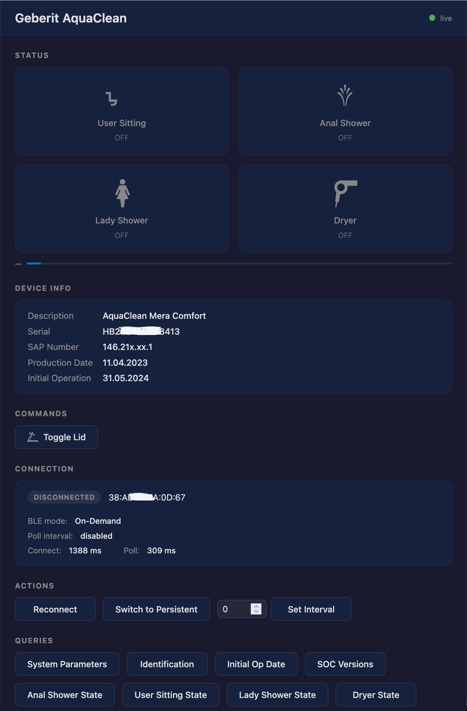
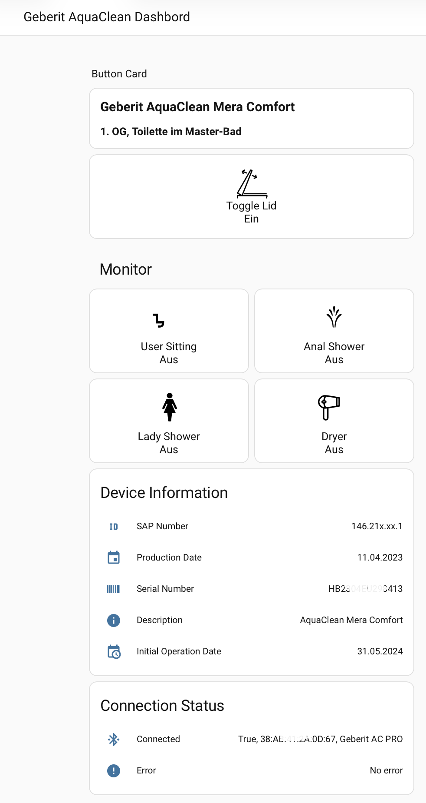

# geberit-aquaclean

Python bridge between a [Geberit AquaClean](https://www.geberit.de/badezimmerprodukte/wcs-urinale/dusch-wcs-geberit-aquaclean/produkte/) smart toilet and your home automation system.

Port of [Thomas Bingel](https://github.com/thomas-bingel)'s C# [geberit-aquaclean](https://github.com/thomas-bingel/geberit-aquaclean) library to Python.

**Key enhancements over the original:**
- **Non-blocking, on-demand BLE** — connects only for the duration of each request, then releases the connection immediately. The original holds BLE permanently, causing the device to stop responding after a few days. On-demand mode eliminates this entirely.
- **ESPHome Bluetooth Proxy** — use an ESP32 as a remote BLE-to-IP bridge, eliminating the need for local Bluetooth hardware; run the bridge anywhere on your network
- **MQTT** — publishes device state in real time; accepts control and configuration commands
- **REST API + web UI** — live dashboard, per-request queries, runtime configuration without restart
- **CLI** — one-shot commands for scripting, diagnostics, and automation
- **Home Assistant** — automatic entity creation via MQTT Discovery, no manual YAML required
- **openHAB** — integrates via MQTT; subscribe to device topics and publish control commands
- **Voice control** — trigger commands by voice via Home Assistant or openHAB (e.g. Amazon Alexa, Google Assistant, Apple Siri)

<table>
  <tr>
    <td align="center">
      <br/>
      <em>Web UI — live status, on-demand queries, runtime config</em>
    </td>
    <td align="center">
      <br/>
      <em>Home Assistant — auto-created entities via MQTT Discovery</em>
    </td>
  </tr>
</table>

---

## Features

- **BLE bridge** — connects to the toilet over Bluetooth LE
- **MQTT** — publishes device state and accepts control commands
- **REST API + web UI** — live dashboard, on-demand queries, runtime config
- **CLI** — one-shot commands for scripting and diagnostics
- **Home Assistant** — automatic entity creation via MQTT Discovery
- **openHAB** — integrates via MQTT; subscribe to device topics and publish control commands
- **Use cases** — greet, play music, dismiss, time sessions, control lights, voice commands — see [docs/use-cases.md](docs/use-cases.md)

---

## Quick start

### 1. Install dependencies

```bash
pip install bleak paho-mqtt aiorun haggis fastapi uvicorn
```

| Package | Version | Purpose |
|---------|---------|---------|
| [bleak](https://github.com/hbldh/bleak) | ≥ 0.22 | BLE connectivity (BlueZ on Linux, CoreBluetooth on macOS) |
| [paho-mqtt](https://github.com/eclipse-paho/paho.mqtt.python) | ≥ 2.0 | MQTT broker client |
| [aiorun](https://github.com/cjrh/aiorun) | ≥ 2024.8 | Asyncio run loop with clean shutdown handling |
| [haggis](https://gitlab.com/madphysicist/haggis) | ≥ 0.14 | Adds `TRACE` and `SILLY` log levels to the Python logging framework |
| [fastapi](https://fastapi.tiangolo.com) | ≥ 0.110 | REST API framework — api mode only |
| [uvicorn](https://www.uvicorn.org) | ≥ 0.29 | ASGI server for FastAPI — api mode only |
| [aioesphomeapi](https://github.com/esphome/aioesphomeapi) | ≥ 24.0 | ESPHome Bluetooth proxy backend — optional, only needed when using an ESP32 as a BLE bridge |

> **ESPHome proxy (optional):** If you use an ESP32 as a remote BLE antenna, install `aioesphomeapi` separately: `pip install aioesphomeapi`

> **Python 3.13 note:** `haggis` requires a [one-line workaround](https://gitlab.com/madphysicist/haggis/-/issues/2#note_2355044561) for a logging compatibility issue. No further problems occur after applying it.

### 2. Find the BLE address

```bash
bluetoothctl scan on
# Look for: [NEW] Device XX:XX:XX:XX:XX:XX Geberit AC PRO
```

### 3. Edit config.ini

```ini
[BLE]
device_id = XX:XX:XX:XX:XX:XX   # from step 2

[MQTT]
server = 192.168.0.xxx           # your MQTT broker IP
```

Full config reference: [docs/configuration.md](docs/configuration.md)

### 4. Run

| Goal | Command |
|------|---------|
| Background service (MQTT only) | `python main.py` |
| REST API + web UI + MQTT | `python main.py --mode api` |
| One-off CLI command | `python main.py --mode cli --command <cmd>` |

---

## Documentation

| Topic | File |
|-------|------|
| Use cases | [docs/use-cases.md](docs/use-cases.md) |
| On-demand BLE connection | [docs/on-demand-ble.md](docs/on-demand-ble.md) |
| BLE coexistence (bridge vs Geberit Home app) | [docs/ble-coexistence.md](docs/ble-coexistence.md) |
| Operating modes | [docs/modes.md](docs/modes.md) |
| Configuration reference | [docs/configuration.md](docs/configuration.md) |
| REST API | [docs/rest-api.md](docs/rest-api.md) |
| Web UI | [docs/webapp.md](docs/webapp.md) |
| CLI commands | [docs/cli.md](docs/cli.md) |
| MQTT topics | [docs/mqtt.md](docs/mqtt.md) |
| Home Assistant setup | [docs/home-assistant.md](docs/home-assistant.md) |
| HA full setup guide | [homeassistant/SETUP_GUIDE.md](homeassistant/SETUP_GUIDE.md) |
| ESPHome Bluetooth Proxy | [docs/esphome.md](docs/esphome.md) |
| ESPHome troubleshooting | [docs/esphome-troubleshooting.md](docs/esphome-troubleshooting.md) |
| ESPHome developer notes | [docs/esphome-developer-notes.md](docs/esphome-developer-notes.md) |

---

## Tested environments

| Hardware | OS | Python |
|----------|----|--------|
| Raspberry Pi 5 | Kali Linux 2024.4 (arm64) | 3.12.8 |
| MacBookAir + VirtualBox | Ubuntu 24.04 (x86-64) | 3.12.3 |

AquaClean firmware: RS28.0 TS199

---

## Architecture

```
# Option 1: Local Bluetooth adapter
AquaClean (BLE) ←→ Raspberry Pi / server ←→ MQTT broker ←→ Home Assistant / openHAB / …
                            ↕
                       REST API / Web UI

# Option 2: ESPHome Bluetooth Proxy (ESP32 as remote BLE antenna)
AquaClean (BLE) ←→ ESP32-POE-ISO ←→ [Ethernet/IP] ←→ Raspberry Pi / server ←→ MQTT broker ←→ HA / openHAB
                   [ESPHome proxy]     port 6053              ↕
                                                         REST API / Web UI
```

---

## Key improvements over the original C# port

The original [Thomas Bingel](https://github.com/thomas-bingel) library (and the initial Python port) keeps a **permanent BLE connection** to the device.  In practice this causes the AquaClean to stop responding after a few days of continuous use — a known limitation of the device firmware.

This project introduces an **on-demand BLE connection mode** that eliminates the problem:

| | Persistent (original) | On-demand (new) |
|-|----------------------|----------------|
| BLE connection | Kept open permanently | Connected per request, then released |
| Long-term stability | Device stops responding after a few days | No long-term connection held — device stays healthy |
| Latency | Instant (always connected) | ~1–2 s per request (connect + query + disconnect) |
| Use case | Continuous monitoring, service mode | REST API, scripting, integrations that poll occasionally |

On-demand mode is selected in `config.ini`:

```ini
[SERVICE]
ble_connection = on-demand
```

Or switched at runtime with no restart needed:

```bash
# via REST API
curl -X POST http://localhost:8080/config/ble-connection \
     -H "Content-Type: application/json" \
     -d '{"value": "on-demand"}'

# via MQTT
mosquitto_pub -h YOUR_BROKER \
  -t "Geberit/AquaClean/centralDevice/config/bleConnection" \
  -m "on-demand"
```

The web UI also has a one-click toggle button.  See [docs/modes.md](docs/modes.md) for a full comparison.

---

## Credits

Original C# library by [Thomas Bingel](https://github.com/thomas-bingel).
