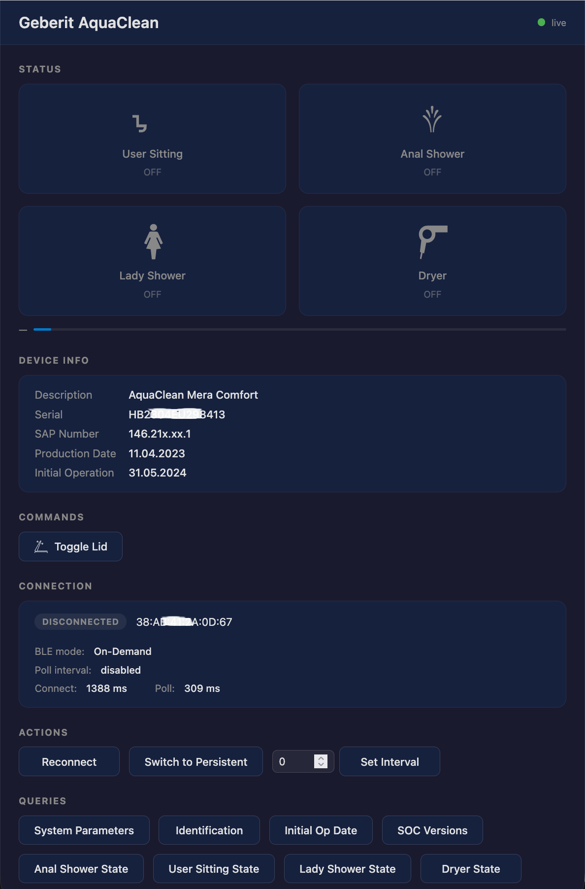

# geberit-aquaclean

Python bridge between a [Geberit AquaClean](https://www.geberit.de/badezimmerprodukte/wcs-urinale/dusch-wcs-geberit-aquaclean/produkte/) smart toilet and your home automation system.

Port of [Thomas Bingel](https://github.com/thomas-bingel)'s C# [geberit-aquaclean](https://github.com/thomas-bingel/geberit-aquaclean) library to Python.

**Key enhancements over the original:**
- **Non-blocking, on-demand BLE** — connects only for the duration of each request, then releases the connection immediately. The original holds BLE permanently, causing the device to stop responding after a few days. On-demand mode eliminates this entirely.
- **ESPHome Bluetooth Proxy** — use an ESP32 as a remote BLE-to-IP bridge, eliminating the need for local Bluetooth hardware; run the bridge anywhere on your network
- **Filter status & lifetime tracking** — reads the ceramic honeycomb filter counter directly from the device: days until replacement, last reset date, total shower cycles. The original C# library has no filter status support.
- **Dryer spray intensity** — exposes the dryer spray intensity setting (read and write), discovered through independent BLE protocol analysis. Not present in the original C# library.
- **MQTT** — publishes device state in real time; accepts control and configuration commands
- **REST API + web UI** — live dashboard, per-request queries, runtime configuration without restart
- **CLI** — one-shot commands for scripting, diagnostics, and automation
- **Home Assistant (HACS)** — native HA integration installable via HACS; no separate Linux machine or MQTT broker needed
- **Home Assistant (MQTT)** — automatic entity creation via MQTT Discovery, no manual YAML required
- **openHAB** — integrates via MQTT; subscribe to device topics and publish control commands
- **Voice control** — trigger commands by voice via Home Assistant or openHAB (e.g. Amazon Alexa, Google Assistant, Apple Siri)

<table>
  <tr>
    <td align="center">
      <br/>
      <em>Web UI — live status, on-demand queries, runtime config</em>
    </td>
    <td align="center">
      <br/>
      <em>Home Assistant HACS integration — native entities, no MQTT broker needed</em>
    </td>
  </tr>
</table>

---

## Features

- **BLE bridge** — connects to the toilet over Bluetooth LE
- **MQTT** — publishes device state and accepts control commands
- **REST API + web UI** — live dashboard, on-demand queries, runtime config
- **CLI** — one-shot commands for scripting and diagnostics
- **Home Assistant (HACS)** — native integration; install via HACS, no MQTT broker or separate server required — see [docs/hacs-integration.md](docs/hacs-integration.md)
- **Home Assistant (MQTT)** — automatic entity creation via MQTT Discovery — see [homeassistant/SETUP_GUIDE.md](homeassistant/SETUP_GUIDE.md)
- **openHAB** — integrates via MQTT; subscribe to device topics and publish control commands
- **Use cases** — greet, play music, dismiss, time sessions, control lights, voice commands — see [docs/use-cases.md](docs/use-cases.md)

---

## Quick start

> **Two installation paths:**
>
> | | Option A — Standalone bridge | Option B — HACS integration |
> |-|-----------------------------|-----------------------------|
> | **What you need** | Raspberry Pi / Linux server + MQTT broker | Home Assistant + ESP32 proxy |
> | **Install** | `curl \| bash` (see below) | HACS custom repository |
> | **Config** | `config.ini` | HA config flow (UI) |
> | **Use if** | You want MQTT, REST API, CLI, openHAB | You only need Home Assistant entities |
>
> For Option B see **[docs/hacs-integration.md](docs/hacs-integration.md)**.
> The steps below cover Option A.

### 1. Install

**Easy — no clone needed (Raspberry Pi / Linux server):**

```bash
curl -fsSL https://raw.githubusercontent.com/jens62/geberit-aquaclean/main/operation_support/install.sh | bash -s -- latest
```

> `curl | bash` executes code from the internet directly. Review the script first if preferred:
> `curl -fsSL https://raw.githubusercontent.com/jens62/geberit-aquaclean/main/operation_support/install.sh`

The script installs system packages and creates `~/venv` if they don't exist yet,
then installs the bridge and prints the next steps. Re-running it with a new version
upgrades in-place.

**If you already have the repo cloned:**

```bash
bash operation_support/install.sh latest
```

**Manual** (replace `<version>` with a release tag — list available releases):

```bash
curl -fsSL https://api.github.com/repos/jens62/geberit-aquaclean/releases | grep '"tag_name"'
```

```bash
python3 -m venv ~/venv
~/venv/bin/pip install --upgrade pip setuptools wheel
~/venv/bin/pip install git+https://github.com/jens62/geberit-aquaclean.git@<version>
```

**Upgrading an existing install** (preserves your `config.ini`, stops/restarts the service automatically):

```bash
curl -fsSL https://raw.githubusercontent.com/jens62/geberit-aquaclean/main/operation_support/update.sh | bash
```

To upgrade to a specific version:

```bash
curl -fsSL https://raw.githubusercontent.com/jens62/geberit-aquaclean/main/operation_support/update.sh | bash -s -- v2.4.63
```

Or if you have the repo cloned:

```bash
bash operation_support/update.sh latest
```

<details>
<summary>Dependencies installed</summary>

| Package | Purpose |
|---------|---------|
| [bleak](https://github.com/hbldh/bleak) | BLE connectivity (BlueZ on Linux, CoreBluetooth on macOS) |
| [aioesphomeapi](https://github.com/esphome/aioesphomeapi) | ESPHome Bluetooth proxy backend |
| [paho-mqtt](https://github.com/eclipse-paho/paho.mqtt.python) | MQTT broker client |
| [aiorun](https://github.com/cjrh/aiorun) | Asyncio run loop with clean shutdown handling |
| [fastapi](https://fastapi.tiangolo.com) | REST API framework |
| [uvicorn](https://www.uvicorn.org) | ASGI server for FastAPI |

</details>

### 2. Find the BLE address

```bash
bluetoothctl scan on
# Look for: [NEW] Device XX:XX:XX:XX:XX:XX Geberit AC PRO
```

### 3. Edit config.ini

Find the installed config file:
```bash
python3 -c "import os, aquaclean_console_app; print(os.path.join(os.path.dirname(aquaclean_console_app.__file__), 'config.ini'))"
# → /path/to/venv/lib/python3.x/site-packages/aquaclean_console_app/config.ini
```

Edit the key values:
```ini
[BLE]
device_id = XX:XX:XX:XX:XX:XX   # from step 2

[MQTT]
server = 192.168.0.xxx           # your MQTT broker IP
```

Full config reference: [docs/configuration.md](docs/configuration.md)

### 4. Install as a background service (recommended for production)

Linux / systemd only:

```bash
curl -fsSL https://raw.githubusercontent.com/jens62/geberit-aquaclean/main/operation_support/setup-service.sh | bash
```

The script downloads the service and logrotate templates, substitutes your
username and venv path automatically, and starts the service.

```bash
sudo systemctl status aquaclean-bridge
tail -f /var/log/aquaclean/aquaclean.log
```

### 5. Or run manually

| Goal | Command |
|------|---------|
| REST API + web UI + MQTT | `aquaclean-bridge --mode api` |
| Background service (MQTT only) | `aquaclean-bridge` |
| One-off CLI command | `aquaclean-bridge --mode cli --command <cmd>` |

---

## Documentation

| Topic | File |
|-------|------|
| **HACS integration (Option B)** | [docs/hacs-integration.md](docs/hacs-integration.md) |
| Use cases | [docs/use-cases.md](docs/use-cases.md) |
| On-demand BLE connection | [docs/on-demand-ble.md](docs/on-demand-ble.md) |
| BLE coexistence (bridge vs Geberit Home app) | [docs/ble-coexistence.md](docs/ble-coexistence.md) |
| Operating modes | [docs/modes.md](docs/modes.md) |
| Configuration reference | [docs/configuration.md](docs/configuration.md) |
| REST API | [docs/rest-api.md](docs/rest-api.md) |
| Web UI | [docs/webapp.md](docs/webapp.md) |
| CLI commands | [docs/cli.md](docs/cli.md) |
| MQTT topics | [docs/mqtt.md](docs/mqtt.md) |
| Home Assistant (MQTT) | [docs/home-assistant.md](docs/home-assistant.md) |
| HA MQTT full setup guide | [homeassistant/SETUP_GUIDE.md](homeassistant/SETUP_GUIDE.md) |
| ESPHome Bluetooth Proxy | [docs/esphome.md](docs/esphome.md) |
| ESPHome troubleshooting | [docs/esphome-troubleshooting.md](docs/esphome-troubleshooting.md) |
| ESPHome developer notes | [docs/esphome-developer-notes.md](docs/esphome-developer-notes.md) |

---

## Tested environments

| Hardware | OS | Python |
|----------|----|--------|
| Raspberry Pi 5 | Kali Linux (arm64) | 3.13 |
| Raspberry Pi 5 | Kali Linux 2024.4 (arm64) | 3.12.8 |
| MacBookAir + VirtualBox | Ubuntu 24.04 (x86-64) | 3.12.3 |
| Debian server (arm64) | Debian 12 Bookworm | 3.11.2 |

| Device | Status | Firmware |
|--------|--------|---------|
| Geberit AquaClean Mera Comfort | ✅ Confirmed working | RS28.0 TS199 |
| Geberit AquaClean Alba | 🚧 Work in progress | Unknown |

---

## Architecture

```
# Option A — Standalone bridge (MQTT, REST API, CLI)
AquaClean (BLE) ←→ ESP32 proxy ←→ [TCP] ←→ Raspberry Pi / server ←→ MQTT broker ←→ HA / openHAB
                [ESPHome proxy]  port 6053          ↕
                                              REST API / Web UI

# Option B — HACS native integration (Home Assistant only, no separate server)
AquaClean (BLE) ←→ ESP32 proxy ←→ [TCP] ←→ Home Assistant (HACS integration)
                [ESPHome proxy]  port 6053
```

---

## Key improvements over the original C# port

The original [Thomas Bingel](https://github.com/thomas-bingel) library (and the initial Python port) keeps a **permanent BLE connection** to the device.  In practice this causes the AquaClean to stop responding after a few days of continuous use — a known limitation of the device firmware.

This project introduces an **on-demand BLE connection mode** that eliminates the problem:

| | Persistent (original) | On-demand (new) |
|-|----------------------|----------------|
| BLE connection | Kept open permanently | Connected per request, then released |
| Long-term stability | Device stops responding after a few days | No long-term connection held — device stays healthy |
| Latency | Instant (always connected) | ~1–2 s per request (connect + query + disconnect) |
| Use case | Continuous monitoring, service mode | REST API, scripting, integrations that poll occasionally |

Beyond connection handling, this project also extends the protocol coverage of the original:

| Feature | Original C# | This project |
|---------|-------------|-------------|
| Filter status & lifetime | ✗ not implemented | ✓ days until replacement, last reset, shower cycle count |
| Dryer spray intensity | ✗ not in original | ✓ read + write, discovered via independent BLE analysis |

On-demand mode is selected in `config.ini`:

```ini
[SERVICE]
ble_connection = on-demand
```

Or switched at runtime with no restart needed:

```bash
# via REST API
curl -X POST http://localhost:8080/config/ble-connection \
     -H "Content-Type: application/json" \
     -d '{"value": "on-demand"}'

# via MQTT
mosquitto_pub -h YOUR_BROKER \
  -t "Geberit/AquaClean/centralDevice/config/bleConnection" \
  -m "on-demand"
```

The web UI also has a one-click toggle button.  See [docs/modes.md](docs/modes.md) for a full comparison.

---

## References

- [Geberit AquaClean Mera Comfort — Service Manual (PDF)](https://cdn.data.geberit.com/documents-a6/972.447.00.0_00-A6.pdf)

---

## Credits

Original C# library by [Thomas Bingel](https://github.com/thomas-bingel).
