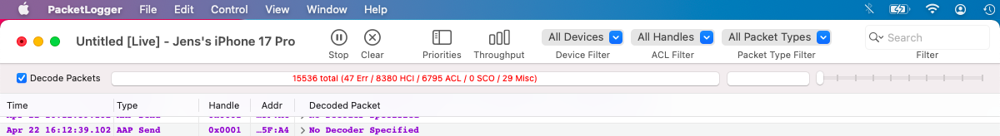
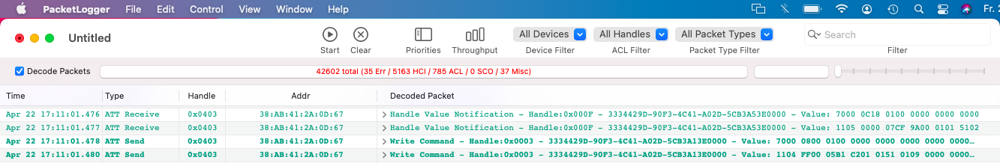
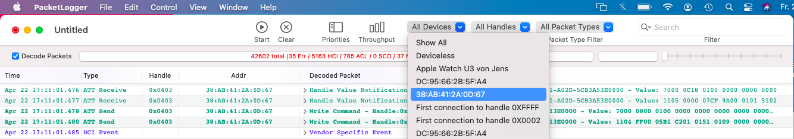
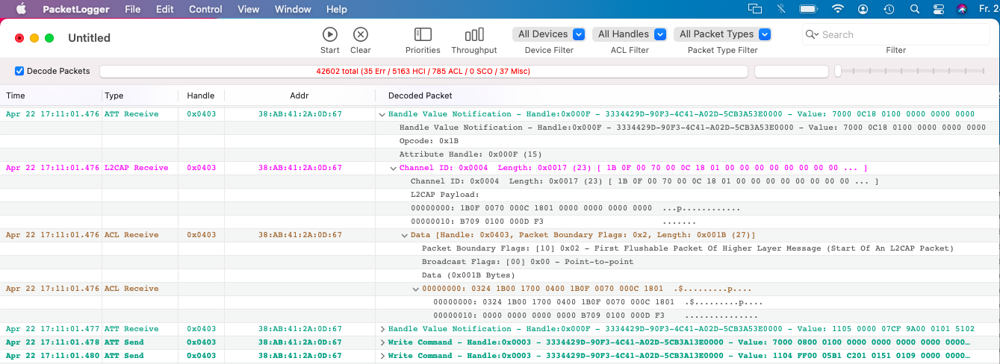
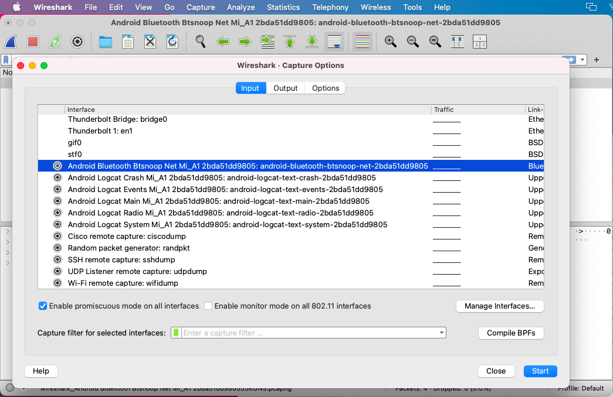
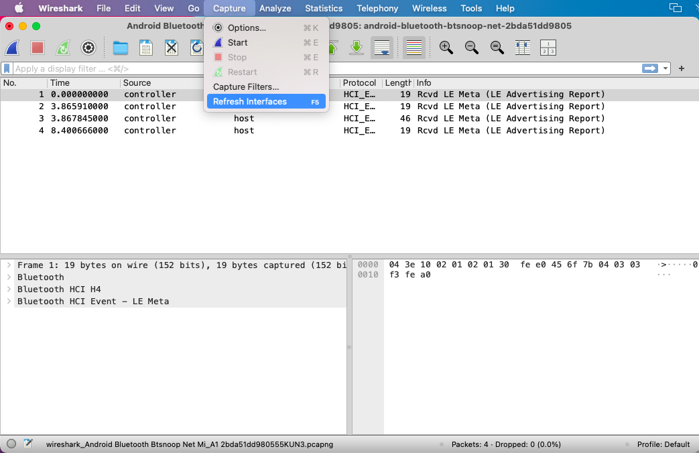

# Capturing BLE Traffic Between the Geberit Home App and the Toilet

Recording the Bluetooth Low Energy traffic between the Geberit Home App and an AquaClean toilet is the primary method for reverse-engineering device behavior: identifying unknown procedure codes, mapping parameter indices, and verifying protocol implementation.

Two capture methods are available depending on which phone you have:

| Method | Platform | Output file | Analysis tool |
|---|---|---|---|
| Apple PacketLogger | iPhone + Mac | `.txt` (Raw Data export) | `tools/ble-decode.py` |
| Android HCI Snoop Log | Android + Wireshark | `.pcapng` | `tools/android-ble-analyze.py` |

---

## iPhone — Apple PacketLogger

### Prerequisites

- An iPhone running the Geberit Home App
- A Mac (any recent macOS version)
- A USB cable (Lightning or USB-C depending on your iPhone model)
- **Additional Tools for Xcode** — download from [developer.apple.com/download/applications](https://developer.apple.com/download/applications) (free, no paid developer account required). PacketLogger is inside the `Hardware I/O` folder. Drag it to `/Applications`.

### Step 1 — Install the iOS Bluetooth Logging Profile

The iPhone does not log Bluetooth traffic by default. A configuration profile activates it.

1. On your **iPhone**, open **Safari** and go to [developer.apple.com/bug-reporting/profiles-and-logs/](https://developer.apple.com/bug-reporting/profiles-and-logs/).
2. Log in with your Apple ID.
3. Scroll to the **Bluetooth** section and tap **Profile** to download it. Tap **Allow** on the popup.
4. Open **Settings**. At the very top you will see **Profile Downloaded** — tap it.
5. Tap **Install** (top right), enter your passcode, and follow the prompts until the profile shows as **Verified**.
6. **Restart your iPhone.** The logging daemon does not start until after a reboot.

> **Finding the profile later:** Settings → General → VPN & Device Management → under "Configuration Profile". If the entry is missing, the download in Safari did not complete — try again.

> **Profile expiry:** Apple's debug profiles expire after a few days. If logging stops working, delete the profile and re-download it.

### Step 2 — Record Traffic

1. Connect your iPhone to your Mac via USB.
2. On your iPhone, tap **Trust This Computer** if prompted.
3. Open **PacketLogger** on your Mac.
4. Click **File → New iOS Trace**. A stream of packets will appear immediately.
   

5. Make sure all settings are configured as shown in the screenshot below.
   

6. On your iPhone, open the **Geberit Home App** and perform the action you want to capture (connect to the toilet, trigger a shower, etc.).
7. Stop the trace once you have captured the action.


### Step 3 — Filter by Device (recommended)

The iPhone talks to every nearby Bluetooth device. Filtering keeps the file small and focused.

1. Find a packet labeled **LE Connection Complete** for the toilet.
2. In the detail pane (bottom), note the **Connection Handle** (e.g. `0x0040`).
3. Type `Handle: 0x0040` in the filter bar at the top of the window.

Alternatively, paste the toilet's MAC address (e.g. `38:AB:41:2A:0D:67`) directly into the filter bar.
   


### Step 4 — Save the Capture

**File → Export → Raw Data…**

The exported file should look as shown below. The disclosure triangles are expanded here to show the captured data.


Save the file with a descriptive name (e.g. `geberit-open-lid-2026-04-22.txt`). This produces a plain-text log that `tools/ble-decode.py` reads directly.

### Troubleshooting

| Symptom | Fix |
|---|---|
| PacketLogger does not see the iPhone | Unplug and re-plug the cable; tap **Trust This Computer** on the iPhone |
| Packet list is empty | Check Settings → General → VPN & Device Management — profile must be installed and not expired |
| Profile is missing from Settings | The Safari download did not complete — retry on iPhone, not on Mac |
| `File → New iOS Trace` is greyed out | iPhone not yet trusted; try unplugging and reconnecting |

> **Privacy:** while the profile is installed, the iPhone logs *all* Bluetooth activity. Delete the profile once you are done (Settings → General → VPN & Device Management → tap profile → Remove Profile).

---

## Android — HCI Snoop Log + Wireshark

### Prerequisites

- An Android phone running the Geberit Home App
- A computer (Mac, Windows, or Linux) with [Wireshark](https://www.wireshark.org/) installed
- A USB cable
- ADB (Android Debug Bridge) — included in [Android SDK Platform Tools](https://developer.android.com/studio/releases/platform-tools); on macOS also available via `brew install android-platform-tools`

### Step 1 — Enable Developer Options

Developer Options are hidden by default. Unlock them by tapping the **Build Number** entry in Settings 7 times rapidly.

**Standard Android (Pixel, stock):**
Settings → About Phone → tap **Build Number** 7 times

**Samsung:**
Settings → About Phone → Software Information → tap **Build Number** 7 times

**Xiaomi / Redmi / MIUI** (e.g. Redmi Note 9):
Settings → About Phone → tap **MIUI Version** 7 times
(Xiaomi uses "MIUI Version" instead of "Build Number")

**Oppo / Realme / ColorOS:**
Settings → About Phone → Version → tap **Build Number** 7 times

The phone shows *"You are now a developer!"* once unlocked.

> **If you cannot find it:** open the Settings search bar and type "Build" or "Developer".

Developer Options appear under Settings → System (stock Android) or Settings → Additional Settings (Xiaomi/MIUI).

### Step 2 — Enable Bluetooth HCI Snoop Log

1. Open **Developer Options** (see above).
2. Also enable **USB Debugging** here.
3. Find **Enable Bluetooth HCI snoop log** and toggle it on.
4. **Toggle Bluetooth off and then on again.** Android requires a Bluetooth restart to begin writing to the log buffer.

**Xiaomi/MIUI extra step:** also enable **USB Debugging (Security Settings)** in Developer Options. Without it, ADB cannot stream Bluetooth log data.

### Step 3 — Capture in Wireshark

1. Connect your phone to your computer via USB.
2. On the phone, tap **Allow USB Debugging** when the authorization prompt appears. Check *Always allow from this computer*.
3. In a terminal, run `adb devices` to verify the connection:
   ```
   List of devices attached
   ZY223XG967  device        ← success
   ZY223XG967  unauthorized  ← tap Allow on the phone
   (empty)                   ← bad cable or USB Debugging not enabled
   ```
4. Open **Wireshark**. In the interface list, look for:
   `Android Bluetooth HCI Snoop [device-serial-number]`

   

5. Double-click it to start the live capture.
6. On your phone, open the **Geberit Home App** and perform the action you want to capture.
7. Stop the capture (red square button) once done.

> **Interface not appearing:** run `adb devices` first, then in Wireshark go to **Capture → Refresh Interfaces** (`Cmd+R`). If it still does not appear, close Wireshark completely, run `adb devices` in the terminal, then reopen Wireshark.



> **Verify Wireshark's androiddump:** run `/Applications/Wireshark.app/Contents/MacOS/extcap/androiddump --extcap-interfaces` in a terminal. If your phone's serial number appears, Wireshark supports it.

> **macOS + Homebrew Wireshark:** you may need `brew install --cask wireshark-chmodbpf` to grant capture permissions.

### Step 4 — Save the Capture

1. **File → Save As…**
2. In the format dropdown, select **Wireshark/tcpdump/... - pcapng**.
3. Save with a descriptive name (e.g. `geberit-open-lid-2026-04-22.pcapng`).

This is the format expected by `tools/android-ble-analyze.py`.

### Troubleshooting

| Symptom | Fix |
|---|---|
| No packets appear after connecting | Toggle Bluetooth off and on on the phone |
| Wireshark does not show the Android interface | Run `adb devices` in terminal, then Capture → Refresh Interfaces in Wireshark |
| `adb devices` shows `unauthorized` | Tap **Allow USB Debugging** on the phone screen |
| `adb devices` shows nothing | Check cable; verify USB Debugging is enabled |
| Xiaomi: ADB connects but no BLE data streams | Enable **USB Debugging (Security Settings)** in Developer Options |

---

## What to Include When Sharing a Capture

When submitting a capture file for analysis (e.g. as a GitHub issue attachment):

1. **iPhone:** attach the `.txt` file from File → Export → Raw Data.
2. **Android:** attach the `.pcapng` file saved from Wireshark.
3. Note what action you performed and at what approximate time (used to find the relevant window in the file).
4. Include the device MAC address and model if known.
