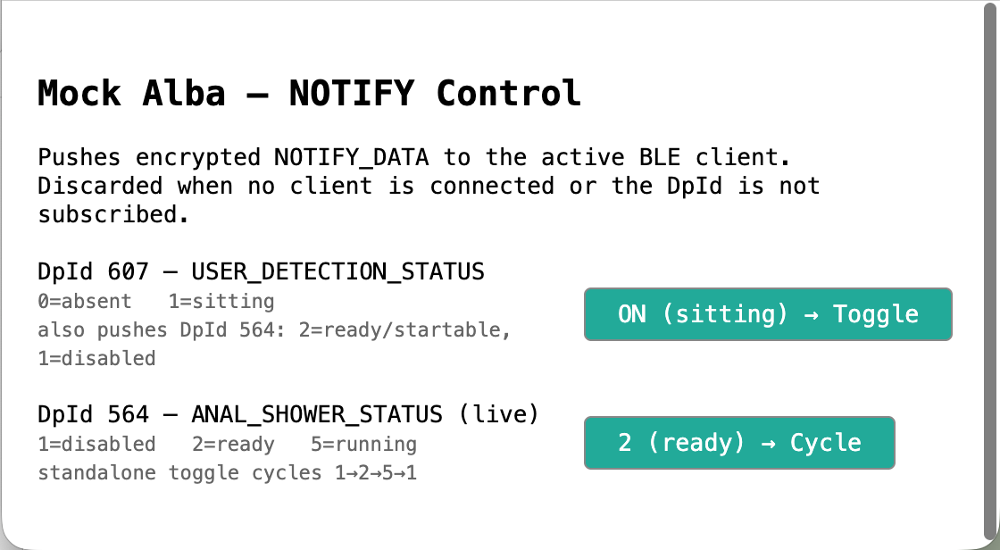

# Mock Geberit AquaClean Alba BLE Peripheral

**File:** `tools/mock-geberit-alba.py`

Simulates the AquaClean Alba BLE peripheral on Linux (BlueZ). Supports three
modes:

| Mode | Purpose |
|------|---------|
| `--mode unsupported` (default) | Advertises the Alba GATT profile but ignores all writes — triggers the unsupported-device detection path in the HACS config flow |
| `--mode handshake` | Implements the full server-side Arendi Security protocol — use this to test end-to-end encryption without a physical Alba |
| `--mode ble20` | Full Alba application layer: Arendi Security + complete Ble20 DpId store — use this to test the Geberit Home App against a mock device |

For a purely in-process crypto test (no BLE hardware at all) see
**`tests/test_arendi_security.py`** below.

---

## Requirements

- Linux with BlueZ (Bluetooth daemon running)
- Python packages: `dbus-next`, `bluez_peripheral`
- Sufficient D-Bus privileges (run as root or with appropriate group membership)
- BlueZ experimental features may be required (`Experimental=true` in `/etc/bluetooth/main.conf`)

```bash
pip install dbus-next bluez_peripheral
sudo /home/jens/venv/bin/python tools/mock-geberit-alba.py --mode handshake
```

---

## Test session setup

Run these steps in order before every test session. Steps 2 and 4 run on the
**mock machine** (Linux/BlueZ); step 3 runs on the **dev machine** (Mac/Windows).

### Placeholders

| Placeholder | Example | Meaning |
|-------------|---------|---------|
| `MOCK_VENV` | `/home/jens/venv/bin/python` | Python interpreter on mock machine |
| `MOCK_LOG_DIR` | `/home/jens` | Directory for mock + btmon logs on mock machine |
| `HA_IP` | `192.168.0.198` | Home Assistant host IP |
| `HA_USER` | `root` | HA SSH user |
| `HA_PASSWORD` | `your-password` | HA SSH password (for `sshpass`) |
| `DEV_LOG_DIR` | `/Users/jens/develop/geberit-aquaclean/local-assets/Bluetooth-Logs/nRF52840/jens62` | Local directory on dev machine for captured logs |

### Step 1 — Clear ESP32 Bluetooth cache (ESPHome proxy only)

The ESP32 caches the mock's GATT handle table in NVS flash. After any BlueZ restart
on the mock machine the handles change; the cached values become stale and writes fail
with `ATT Error: Invalid Handle`. Clear the cache before each session:

- **ESPHome web UI** (simplest): open `http://<ESP32-IP>` → **"Clear Bluetooth Cache"** button.
- **ESPHome YAML** (if the button is absent): see `docs/developer/test-infrastructure.md`
  for the `esp32.clear_nvs` OTA approach.

Skip this step if testing over **local BLE** (no ESP32 proxy involved).

### Step 2 — Start btmon (mock machine)

Captures all BLE HCI events to a timestamped btsnoop file for post-session analysis.
Run in a dedicated terminal **before** starting the mock:

```bash
sudo btmon -w MOCK_LOG_DIR/hacs_zero-conf_esp__btmon_$(date +%F_%H-%M).btsnoop
```

Example:
```bash
sudo btmon -w /home/jens/hacs_zero-conf_esp__btmon_$(date +%F_%H-%M).btsnoop
```

### Step 3 — Stream HA core log (dev machine)

Captures Home Assistant core log to a local file for the duration of the session.
Run in a dedicated terminal on the dev machine:

```bash
sshpass -p 'HA_PASSWORD' ssh HA_USER@HA_IP "ha core logs --follow" \
  | tee DEV_LOG_DIR/ha_core_$(date +%F_%H-%M).log
```

Example:
```bash
sshpass -p 'your-password' ssh root@192.168.0.198 "ha core logs --follow" \
  | tee /Users/jens/develop/geberit-aquaclean/local-assets/Bluetooth-Logs/nRF52840/jens62/ha_core_$(date +%F_%H-%M).log
```

For **Windows PowerShell** and additional options see
`docs/hacs-integration.md` → "HA core log" section.

### Step 4 — Start the mock (mock machine)

```bash
sudo MOCK_VENV -u ./mock-geberit-alba.py --mode ble20 2>&1 \
  | tee MOCK_LOG_DIR/hacs_zero-conf_esp_$(date +%F_%H-%M).log
```

Example:
```bash
sudo /home/jens/venv/bin/python -u ./mock-geberit-alba.py --mode ble20 2>&1 \
  | tee /home/jens/hacs_zero-conf_esp_$(date +%F_%H-%M).log
```

Wait for `--- Mock Device Active (mode=ble20) ---` and note the printed adapter MAC
address before proceeding with the test.

---

## GATT profile advertised

The mock exposes two services that match the real Alba device profile
(confirmed from iPhone BLE capture of `E4:85:01:CD:B0:08`):

| Service UUID | Description |
|---|---|
| `559eb100-2390-11e8-b467-0ed5f89f718b` | Vendor service A (write + read only, no notify) |
| `0000fd48-0000-1000-8000-00805f9b34fb` | BT SIG-registered service with vendor characteristics |

Characteristics on `0000fd48`:

| UUID | Properties | Role |
|---|---|---|
| `559eb001-2390-11e8-b467-0ed5f89f718b` | WRITE_NO_RESP | Command channel (write) |
| `559eb002-2390-11e8-b467-0ed5f89f718b` | NOTIFY | Notification channel (read) |

`classify_services()` in `GattDiscovery.py` identifies this as the Alba
candidate profile (`is_standard=False`).

---

## Device MAC address

The mock's BLE address is the Linux BT adapter's own MAC — whatever
`hci0` reports (e.g. `88:A2:9E:2C:EA:F7` on the dev Raspberry Pi).
The mock prints it at startup as **"Adapter BLE address"**.
Use this MAC in all test invocations.

---

## Mode: `--mode handshake` — testing Alba decryption

### What it tests

Verifies that the bridge's `AriendiSecurity.py` implementation can:
1. Complete the full Arendi Security handshake against a live BLE peer
2. Encrypt outgoing Geberit frames correctly
3. Decrypt incoming encrypted frames correctly

The mock generates fresh ephemeral X25519 keys and random nonces on every
run, so each session is cryptographically independent.

### How it works

`_AriendiServerSide` in `mock-geberit-alba.py` implements the device role of
the protocol, importing the crypto primitives directly from
`aquaclean_console_app/bluetooth_le/LE/AriendiSecurity.py` (no duplication).

Handshake sequence (device side):

| Step | Receives | Sends |
|------|----------|-------|
| 1 | SABM (U-frame) | UA (U-frame) |
| 2 | VERSION_REQ (0x00) | VERSION_RESP (0x01) — proto v2 |
| 3 | EP_REQ (0x10) | EP_RESP (0x11) — fresh nonce1 + nonce2 |
| 4 | KE_REQ (0x12) — client pubkey + CMAC | KE_RESP (0x13) — server pubkey + CMAC |
| 5 | S-RR ACK | — |

After the handshake the mock loops on incoming encrypted frames: it decrypts
each one, prints the plaintext hex, and sends back a fake `GetDeviceIdentification`
OK response (encrypted).

Key derivation (device perspective):
- `key_material = HKDF(shared_secret, salt=nonce1, length=32)`
- `tx_key = key_material[0:16]` — device encrypts outgoing with this
- `rx_key = key_material[16:32]` — device decrypts incoming with this

(Reversed from the client perspective in `AriendiSecurity.perform_handshake`.)

### Step-by-step

**Step 1 — Start the mock on the Raspberry Pi:**
```bash
sudo /home/jens/venv/bin/python tools/mock-geberit-alba.py --mode handshake
```
Wait for `--- Mock Device Active (mode=handshake) ---` and note the printed
adapter MAC address.

**Step 2 — Point the bridge at the mock MAC.**
Edit `config.ini` on the Pi:
```ini
[BLE]
device_id = 88:A2:9E:2C:EA:F7   # ← replace with your adapter MAC
```

**Step 3 — Start the bridge:**
```bash
/home/jens/venv/bin/python -m aquaclean_console_app --mode service
```

**Expected mock output when the handshake succeeds:**
```
[Mock] BLE client connected:    XX:XX:XX:XX:XX:XX
[MockServer] ← SABM
[MockServer] → UA
[MockServer] ← VERSION_REQ
[MockServer] → VERSION_RESP (proto v2)
[MockServer] ← EP_REQ
[MockServer] → EP_RESP  nonce1=<32 hex chars>  nonce2=<32 hex chars>
[MockServer] ← KE_REQ
[MockServer] client CMAC verified ✓
[MockServer] → KE_RESP  server_pub=<16 hex chars>...
[MockServer] *** HANDSHAKE COMPLETE — session keys established ***
[MockServer] ← encrypted frame DECRYPTED: <hex of Geberit request>
[MockServer] → fake GetDeviceIdentification response (encrypted)
```

The line `client CMAC verified ✓` confirms the `aquacleanBridgeId` in
`AriendiSecurity.py` is correct. If it says `CMAC verification FAILED`, the
key stored in the bridge does not match what the real device expects.

### HACS config flow with `--mode handshake`

When `arendi_handshake_done = True`, the HACS coordinator and config flow no
longer abort with E0010 / unsupported-device — the Alba is treated as a
supported device and polling proceeds normally. The first poll will send a
`GetSystemParameterList` request; the mock decrypts it and responds with the
fake `GetDeviceIdentification` blob. The bridge may log a parse warning on the
fake response, but the decryption layer is confirmed working.

---

## Mode: `--mode unsupported` (default) — testing HACS unsupported-device detection

### Goal

Verify that the HACS config flow shows the `unsupported_device` abort screen
(with GATT UUID details) instead of the generic `cannot_connect` error.

### Prerequisite — free the ESP32 subscription slot

The ESP32 can only serve one BLE advertisement subscription at a time. Two things
compete for that slot and must both be cleared before testing:

1. **`aquaclean-proxy` ESPHome integration** — disable it in HA → Settings →
   Integrations → aquaclean-proxy → Disable. This is the primary slot thief.

2. **Existing Geberit AquaClean HACS integration** — do **not** delete or disable it;
   you will add the mock as a *second* instance alongside it. But its polling holds
   the slot briefly on each cycle. To minimise the race:
   - Settings → Integrations → Geberit AquaClean → Configure → set Poll Interval
     to `300` seconds. This leaves a 5-minute gap between polls.
   - Or disable it temporarily (three dots → Disable) — HA remembers the config;
     re-enable after the test.

### Steps

1. Apply the prerequisite above.

2. Start the mock:
   ```bash
   sudo /home/jens/venv/bin/python tools/mock-geberit-alba.py
   ```
   Wait for `--- Mock Device Active (mode=unsupported) ---`.

3. **Immediately** go to HA: Settings → Integrations → **"Eintrag hinzufügen"**
   (German UI) / **"Add entry"** (English UI) → search "Geberit AquaClean" → select it.
   - BLE MAC: `<adapter MAC printed by mock>`
   - ESPHome host: `<ESP32 IP>` (or leave empty for local BLE)
   - Port: `6053`

   **Do not** use the existing integration's Configure button — that reconfigures the
   real device. "Add entry" adds a second instance pointing to the mock.

4. Click Submit. Wait up to 30 seconds.

5. Expected result: "unsupported device" abort screen with the GATT UUIDs and a
   link to open a GitHub issue.

   Mock terminal should print:
   ```
   [Mock] BLE client connected:    XX:XX:XX:XX:XX:XX
   [Mock] BLE client disconnected: /org/bluez/hci0/dev_XX_XX_XX_XX_XX_XX
   ```

### Confirming via HA logs

```yaml
logger:
  default: warning
  logs:
    custom_components.geberit_aquaclean: info
```

Expected log lines:
```
INFO  [AquaClean] Config flow: BLE connected but non-standard GATT profile
      detected after init failure — svc=0000fd48... write=[559eb001...] notify=[559eb002...]
WARNING [AquaClean] Config flow: unsupported GATT profile — svc=0000fd48...
```

If you see `connection test failed` with `0 total BLE advertisement packet(s)`:
the `aquaclean-proxy` ESPHome integration is still enabled or another client
holds the subscription slot.

---

## Mode: `--mode ble20` — full Ble20 application layer

### What it tests

The complete Alba application protocol as seen by the **Geberit Home App** (iOS/Android).
Specifically:

- Full Arendi Security handshake (same as `--mode handshake`)
- Phase 1 — raw Ble20 initialization sequence (DataPointInventory, ReadCapabilities,
  EventStorageInventory, ReadRsTsVersion)
- Phase 2 — TunnelDataExchange-wrapped (0xD0) repeat of the same sequence, which the
  app runs after Phase 1 completes via `GetEndProduct()`
- All standard Ble20 commands: Read, Write, Notify subscription, List/Event inventories

### How to run

```bash
sudo /Users/jens/venv/bin/python tools/mock-geberit-alba.py --mode ble20
```

Connect the Geberit Home App to the mock's BLE address (printed at startup).

### Two-phase connection (why 0xD0 frames appear)

After Phase 1 (`Initialize()`) completes, the app creates a second
`ConfigurationManager` that wraps all BLE writes in a `TunnelDataExchange`
header (`0xD0 series variant uid[4] len-1 inner_frame`).  Phase 2 runs an
identical inventory + read sequence, but every frame is wrapped with this header.

The mock's `_Ble20AppLayer.dispatch()` detects `cmd == 0xD0` and calls
`_tunnel_dispatch()`, which:
1. Parses the tunnel header (series, variant, 4-byte uid)
2. Extracts each inner frame (packed as `len-1 + bytes` pairs)
3. Dispatches each inner frame through `_dispatch_sync()` (identical to the raw path)
4. Wraps each response with the same tunnel header before returning

Log output during Phase 2 looks like:
```
[MockServer] ← encrypted frame DECRYPTED: d0fa009a6a1202...
[MockBle20] [tunnel] inner cmd=0x00        ← InventoryCmd
[MockBle20] → INVENTORY_DATA DpId=0        ← ×78 entries
[MockServer] → cmd=0xD0 N(S)=...           ← each wrapped response
```

### Timing: gap between Phase 1 and Phase 2

The app takes **10–20 seconds** between Phase 1 completing and sending the first
Phase 2 frame.  This gap is caused by async UI rendering and optional cloud calls
on the app's main thread.  The mock uses a 30 s inter-frame timeout (not 5 s) to
survive this gap — this is intentional.

### Known limitation: cloud sync ("jetzt verbinden")

After `GetEndProduct()` succeeds, the app calls `SyncSettingsForDevice("250-0")`
— an HTTPS call to the Geberit cloud.  The mock cannot serve this.  The
connection itself succeeds (no "cannot connect" error), but the "jetzt verbinden"
button may show a cloud-related error.  This is a separate issue from the Ble20
protocol layer.

### DpId store

The mock maintains 78 DpIds mirroring a real AquaClean Alba (series 250), with
obfuscated values for identifiers (device number, serial, timestamps offset by
-457751 s, counters offset by -57911).  DpId=236 (`UNIQUE_DEVICE_NUMBER`) returns
the obfuscated value `34761370` — the app uses this as the tunnel `uniqueId`.

---

## Known behaviour / gotchas

### 1. May stop re-advertising after a connect/disconnect cycle

BlueZ peripheral advertising can pause after a client connects and disconnects.
**Always restart the mock fresh before each test session.**

### 2. HA ESPHome integration must be disabled

See prerequisite above — this is the most common cause of `0 packets received`.

### 3. Connection test Step 5 may fail even if Step 4 finds the device

The re-subscription gap between Steps 4 and 5 in `aquaclean-connection-test.py`
plus the advertising pause can cause Step 5 to miss the mock. Step 6 (GATT
discovery via direct connect) still works. This is a timing artifact in the
test script, not a mock defect.

### 4. Notification sending (`--mode handshake`)

The mock sends BLE notifications by calling
`emit_properties_changed({'Value': Variant('ay', data)})` on the notify
characteristic's dbus-next `ServiceInterface`. BlueZ intercepts this D-Bus
`PropertiesChanged` signal and converts it to a BLE ATT Handle Value
Notification. This relies on bluez_peripheral storing characteristic objects
in `Service._chars` in declaration order (`_chars[0]` = sig_write,
`_chars[1]` = sig_notify) — an implementation detail that may change across
bluez_peripheral versions. If notifications are not received by the bridge,
check the mock's `"Notify characteristic interface wired."` startup line; if
it prints `"notifications disabled"` instead, the `_chars` layout has changed
and the index needs updating in `mock-geberit-alba.py:main()`.

---

## In-process unit test — `tests/test_arendi_security.py`

No BLE hardware required. Runs on any machine with the project venv.

### What it tests

| Test | What it verifies |
|------|-----------------|
| `test_handshake_completes` | Both client and server reach `handshake_done = True` |
| `test_client_to_server_encryption` | Client encrypts; server decrypts to original plaintext |
| `test_server_to_client_encryption` | Server encrypts; client decrypts to original plaintext |
| `test_round_trip_multiple_frames` | 5 frames in each direction all decrypt correctly |
| `test_tampered_frame_dropped` | A byte-flipped frame is rejected by the CRC check |
| `test_wrong_auth_key_fails_cmac` | Wrong key causes KE_REQ CMAC verification to fail |

### How to run

```bash
# Standalone
/Users/jens/venv/bin/python tests/test_arendi_security.py

# With pytest
/Users/jens/venv/bin/python -m pytest tests/test_arendi_security.py -v
```

Expected output:
```
PASS test_handshake_completes
PASS test_client_to_server_encryption
PASS test_server_to_client_encryption
PASS test_round_trip_multiple_frames
PASS test_tampered_frame_dropped
PASS test_wrong_auth_key_fails_cmac

6 passed, 0 failed
```

### How it works

The test instantiates a real `AriendiSecurity` (client) and a `_ServerSide`
(device role, same logic as `_AriendiServerSide` in the mock) and pipes ATT
bytes between them via `asyncio.Queue` — no BLE stack involved. Each test runs
a fresh handshake with random nonces and ephemeral keys, so the session keys
differ on every run.

**Run this before any hardware test.** If any test fails here, both the mock
and a real Alba will fail for the same reason — fix the crypto layer first.

---

## How the unsupported-device detection works (v2.4.81-pre)

`connect_ble_only()` partially succeeds for the Alba device:
1. BLE connects → `connector.client` is set with full GATT service table
2. `subscribe_notifications_async()` times out (mock ignores Geberit frames) → exception

The exception handler in `config_flow._test_connection()` calls
`connector.get_gatt_profile()`, and if the profile is non-standard returns it
to the caller — which aborts with `reason="unsupported_device"` instead of the
generic error.

## How Alba support works when the handshake succeeds

`_post_connect()` detects Variant A, creates `AriendiSecurity`, and calls
`perform_handshake()`. If the handshake completes, `connector.arendi_handshake_done`
is `True`. The coordinator and config flow check `is_variant_a and not arendi_handshake_done`
before raising E0010 — so a successful handshake falls through to normal polling.

---

## Web UI — NOTIFY Control (`--mode ble20`)

When `--mode ble20` is used, the mock starts a local HTTP control panel on
`http://0.0.0.0:8765/` (configurable via `--web-port`).



The panel lets you manually push encrypted `NOTIFY_DATA` frames to the connected
BLE client without restarting the mock:

| Control | What it does |
|---------|-------------|
| **DpId 607 — USER_DETECTION_STATUS** toggle | Switches between `0=absent` and `1=sitting`; simultaneously pushes a coupled DpId 564 update (`2=ready` when sitting, `1=disabled` when absent) |
| **DpId 564 — ANAL_SHOWER_STATUS** cycle | Standalone toggle cycling `1=disabled → 2=ready → 5=running → 1`; overrides the value without touching DpId 607 |

Notifications are silently discarded when no BLE client is connected or the DpId
is not subscribed. The page auto-refreshes every 2 seconds to show the live value
read from the mock's internal store.

To disable the web UI: `--web-port 0`.

---

## Implemented behavior examples

> **Not all Alba functionality is implemented.** The mock's DpId store covers all
> 78 DpIds returned by the real kstr Alba device (series 250) and handles generic
> Read/Write/Notify correctly for all of them. However, only the shower control flow
> below has specific behaviour logic wired up. All other DpIds are stored in memory,
> readable, and writable, but produce no side effects.

### User sitting + shower start/stop (fully wired)

This end-to-end flow is implemented as a working example of the mock's notification
architecture:

**1 — User sits down (web UI or app write to DpId 607)**

Pushing the toggle in the web UI sends:
- `NOTIFY_DATA DpId=607 value=0x01` (USER_DETECTION_STATUS = sitting)
- `NOTIFY_DATA DpId=564 value=0x02` (ANAL_SHOWER_STATUS = Ready/startable)

The Geberit Home App reacts by enabling the **Start shower** button in Remote Control.

**2 — App writes DpId 563 = 0x01 (start shower)**

The mock's `_write` handler detects `dp_id=563 value=\x01` and immediately:
- Sets the internal DpId 564 store to `0x05` (ANAL_SHOWER_STATUS = Shower running)
- Sends `NOTIFY_DATA DpId=564 value=0x05`

The app reacts by enabling the **Stop shower** button.

**3 — App writes DpId 563 = 0x00 (stop shower)**

The mock schedules an async wind-down sequence that simulates the real device's
retraction and post-rinsing phases:

| Delay | DpId 564 value | State name |
|-------|---------------|------------|
| 0.5 s | 0x06 | Retracting |
| 1.5 s | 0x07 | Postrinsing |
| 3.0 s | 0x02 | Ready |

Each step sends a `NOTIFY_DATA` so the app's progress indicator updates in real
time. After the sequence completes the shower can be started again.

### DpId 564 enum reference

| Value | Name | Remote Control state |
|-------|------|---------------------|
| 0 | Error | — |
| 1 | Disabled | Start disabled (no user detected) |
| 2 | Ready | **Start enabled** (user sitting) |
| 3 | Prerinsing | — |
| 4 | Extending | — |
| 5 | Shower | **Stop enabled** |
| 6 | Retracting | — |
| 7 | Postrinsing | — |

Source: decompiled iOS app v2.14.1; confirmed against kstr device probe
(`local-assets/Android-BLE-Logs/kstr/`).

---

## Current status — mock 2.18.6 (2026-06-18)

| Fact | Detail |
|------|--------|
| Phase 1 | ✅ completes correctly |
| Phase 2 (TunnelDataExchange 0xD0) | ✅ implemented and tested |
| Phase 3 ("Jetzt verbinden" SABM) | ✅ implemented — mid-session SABM on same BLE connection |
| Shower start/stop flow | ✅ DpId 563→564 mirroring with async wind-down |
| Web UI NOTIFY control | ✅ HTTP control panel on port 8765 |
| 559eb110 data | Correct — `05 06 FA 00 D1 4C 13 02 95 04 03 20 01 0E 01 01 02 00` confirmed by `GeberitFirstconnection.decoded.txt` |
| Device name "AC250" | Correct for all Alba 250 devices; uniqueness via BLE MAC, not name |

**Authoritative reference for 559eb110 value:**
`local-assets/Android-BLE-Logs/kstr/GeberitFirstconnection.decoded.txt` — GATT handle `att_handle=0x0010`, read before Phase 1 SABM.

---

## btmon correlation tool

`tools/analyze-btmon-mock.py` correlates a btmon btsnoop binary capture with a mock server log
to produce a unified timeline. Auto-detects the clock offset between btmon and mock log
by matching ATT Write Command payloads.

```bash
/Users/jens/venv/bin/python tools/analyze-btmon-mock.py \
  path/to/capture.btsnoop path/to/mock.log
```

Flags: `--att-only`, `--no-color`, `--summary-only`, `--gap MS`, `--offset-ms FLOAT`

---

## Connection test usage

```bash
# Via ESPHome proxy
/Users/jens/venv/bin/python tools/aquaclean-connection-test.py \
  --mac 88:A2:9E:2C:EA:F7 --dynamic-uuids --host 192.168.0.114

# Via local BLE
/Users/jens/venv/bin/python tools/aquaclean-connection-test.py \
  --mac 88:A2:9E:2C:EA:F7 --dynamic-uuids
```

Expected result: Step 6 GATT discovery succeeds and shows the `0000fd48`
service; protocol probe fails with `BLEPeripheralTimeoutError` (expected for
`--mode unsupported`). With `--mode handshake` the probe completes the
handshake and the connection test reports success.
