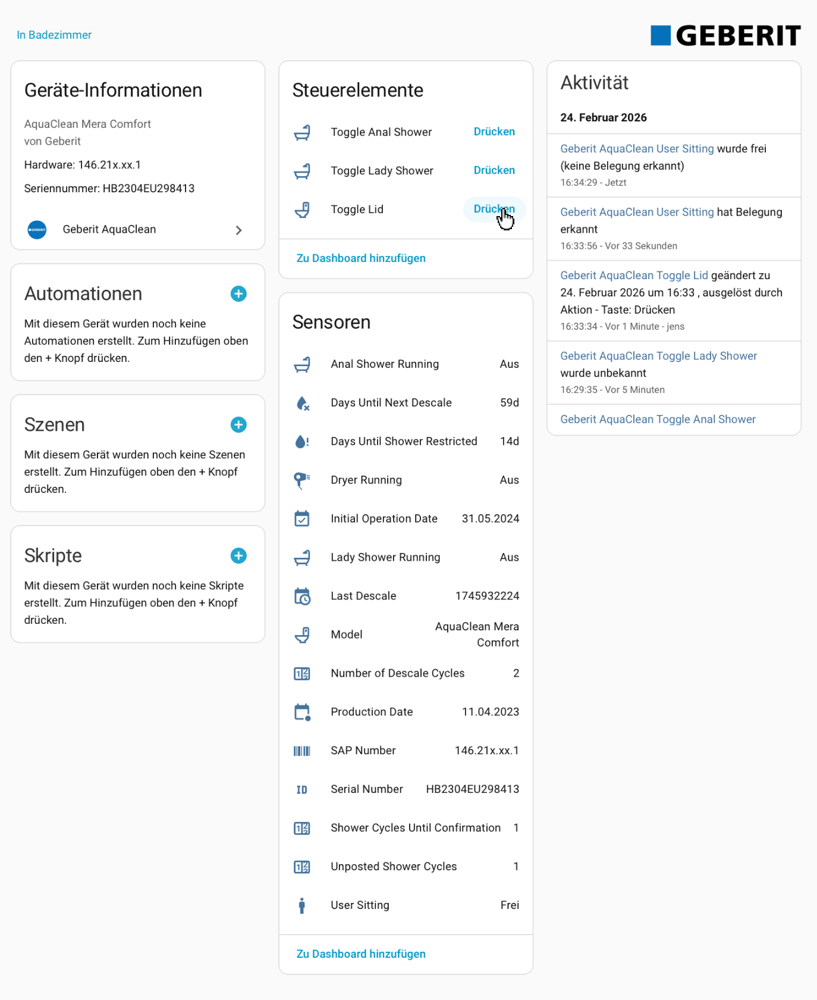

# Geberit AquaClean — HACS Custom Integration

This is the **native Home Assistant integration** for the Geberit AquaClean.
It is installed via HACS and configured entirely within the Home Assistant UI — no separate Linux machine, no MQTT broker, and no config files required.

For the alternative MQTT-based setup (standalone bridge on a Raspberry Pi), see [`homeassistant/SETUP_GUIDE.md`](../homeassistant/SETUP_GUIDE.md).

> ### ⚠️ Tested with ESPHome Bluetooth proxy only
>
> **This integration has been tested exclusively with an ESP32 running the ESPHome
> `bluetooth_proxy` component as the BLE-to-TCP bridge.**
>
> The following configurations are **untested and may not work**:
> - Home Assistant with a built-in Bluetooth adapter (e.g. Raspberry Pi onboard BT)
> - USB Bluetooth dongles connected to the HA host
> - HA OS Bluetooth integration (`bluetooth` domain)
>
> If you do not have an ESP32 ESPHome proxy, set one up first — see the
> [ESPHome proxy setup](#esphome-proxy) section below.
> Reports from users testing direct BLE (without ESP32) are welcome via GitHub Issues.

---

## Architecture

```
Geberit AquaClean (BLE)
        ↕  Bluetooth Low Energy
  ESP32 ESPHome proxy
        ↕  TCP/IP (aioesphomeapi, port 6053)
  Home Assistant (HAOS)
        ↕  Internal coordinator
  HA entities (sensors, switches, binary sensors)
```

### How the integration connects to the toilet

The integration uses the same `BluetoothLeConnector` code as the standalone bridge.
It opens a **direct TCP connection** to the ESP32 running the ESPHome `bluetooth_proxy` component, then performs every BLE operation (scan, connect, communicate) over that TCP link.

**Tested configuration:** ESPHome Bluetooth proxy only.
Direct local BLE (HA hardware with a built-in Bluetooth adapter, no ESP32) has **not been tested**.

### What we bypass — HA's native Bluetooth stack

Home Assistant has its own `bluetooth` integration that manages BLE adapters, exposes a Bluetooth panel, and lets integrations subscribe to BLE advertisements natively.
**This integration does not use any of that.**

| Feature | This integration | HA native Bluetooth |
|---------|-----------------|---------------------|
| BLE adapter on HA hardware | Not required | Required |
| Device in HA Bluetooth panel | No | Yes |
| BLE auto-discovery | No | Yes |
| ESPHome proxy supported | Yes | Yes (different path) |
| Hardware cost | ESP32 (~€5–15) only | ESP32 or BT dongle |

**Why bypass HA's Bluetooth stack?**

| Pro | Con |
|-----|-----|
| Same proven code path as standalone bridge — already battle-tested | Toilet does not appear in HA's Bluetooth panel |
| No Bluetooth adapter needed on the HA machine | No BLE-based auto-discovery of the device |
| Lower implementation risk (no `habluetooth` / `bleak-esphome` integration layer) | Requires ESPHome proxy (direct local BLE is untested) |
| HA hardware can be in a server room — ESP32 handles BLE proximity | |

The ESP32 ESPHome proxy costs €5–15 and is the recommended (and only tested) path.

---

## Prerequisites

- **Home Assistant OS** or Supervised, version **2024.4.1** or newer
- **HACS** installed (see below)
- **GitHub account** (required for HACS authentication)
- **ESP32** running ESPHome with `bluetooth_proxy` and a `restart` button in the YAML (see [`docs/esphome.md`](esphome.md))
- The ESP32 must be physically close to the toilet (BLE range)

---

## Step 1 — Install HACS

Skip this step if HACS is already installed.

1. Go to **Settings → Add-ons → Add-on Store**
2. Click the **three dots (⋮)** → **Repositories**
3. Add `https://github.com/hacs/addons` and close
4. Search for **Get HACS**, install it, and click **Start**
5. Open the **Logs** tab of the add-on; follow the instructions and restart Home Assistant
6. Go to **Settings → Devices & Services → Add Integration**, search for **HACS**, and complete GitHub authentication

> After HACS is installed, enable **Advanced Mode** in your profile (Profile → scroll down → Advanced Mode) to see all options.

---

## Step 2 — Add the custom repository to HACS

1. Open **HACS** from the sidebar
2. Click the **three dots (⋮)** in the top right → **Custom repositories**
3. Paste: `https://github.com/jens62/geberit-aquaclean`
4. Select category: **Integration**
5. Click **Add**

---

## Step 3 — Download the integration

1. In HACS, search for **Geberit AquaClean**
2. Click on the repository card
3. Click **Download** (bottom right)
4. In the version popup, select the latest stable version
   To see pre-release versions: toggle **Show beta versions** in the same popup
5. Click **Download** to confirm

---

## Step 4 — Restart Home Assistant

After downloading, Home Assistant must be restarted before the integration appears in the integration list.

**Settings → System → Restart**

---

## Step 5 — Configure the integration

1. Go to **Settings → Devices & Services**
2. Click **+ Add Integration** (bottom right)
3. Search for **Geberit AquaClean** and select it
4. Fill in the configuration form:

| Field | Description |
|-------|-------------|
| **BLE MAC Address** | MAC address of your AquaClean, e.g. `38:AB:41:2A:0D:67` — find it in the Geberit app or via `ble-scan.py` |
| **ESPHome Proxy Host** | IP address of your ESP32, e.g. `192.168.0.160` |
| **ESPHome Proxy Port** | Default: `6053` — only change if you customised the ESPHome port |
| **ESPHome Encryption Key** | Base64 noise PSK from your ESPHome YAML — leave blank if not set |
| **Poll Interval (seconds)** | How often to fetch data; default `30` |

5. Click **OK** — the integration performs a live BLE connection test. If it succeeds, the device is registered.

> The connection test actually connects to the Geberit via BLE and disconnects. It requires the toilet to be powered on and the ESP32 to be reachable. Allow up to 30 seconds.

---

## Entities

After setup, HA registers three devices under Settings → Devices & Services:

### Geberit AquaClean (toilet)

| Type | Entity |
|------|--------|
| Binary sensor | **BLE Connected** — `True` (green) when the last poll reached the Geberit via BLE, `False` (red) when the last poll failed; attribute `connected_at` shows the timestamp of the last successful BLE connect |
| Binary sensor | User Sitting, Anal Shower Running, Lady Shower Running, Dryer Running |
| Sensor | **BLE Connection** — shows `{BLE device name} (MAC)` after the first successful poll, or just the MAC until then |
| Sensor | Model, Serial Number, SAP Number, Production Date, Initial Operation Date, SOC Versions |
| Sensor (descale) | Days Until Next Descale, Days Until Shower Restricted, Shower Cycles Until Confirmation, Number of Descale Cycles, Last Descale, Unposted Shower Cycles |
| Button | Toggle Lid, Toggle Anal Shower, Toggle Lady Shower |
| Sensor (poll) | Last Poll, Poll Interval, Next Poll |
| Sensor | **BLE Signal** — Geberit BLE advertisement RSSI in dBm (signal strength between ESP32 and toilet) |

### AquaClean Proxy *(only when ESPHome host is configured)*

| Type | Entity |
|------|--------|
| Binary sensor | **Connected** — shows Connected (green) as long as the ESP32 is reachable; only drops to Disconnected when a poll actually fails at the TCP level |
| Sensor | **Connection** — shows `{ESPHome device name} (host:port)` after the first successful poll, or just `host:port` until then |
| Sensor | **WiFi Signal** — ESP32 WiFi RSSI in dBm (requires `platform: wifi_signal` in ESPHome YAML) |
| Sensor (diagnostic) | **Free Heap** — ESP32 free heap memory in bytes (requires `platform: debug, free:` in ESPHome YAML) |
| Sensor (diagnostic) | **Max Free Block** — ESP32 max contiguous free block in bytes (requires `platform: debug, block:` in ESPHome YAML) |
| Sensor (diagnostic) | **Last Connect** — connect time of the last poll cycle in ms |
| Sensor (diagnostic) | **Last Poll** — GATT data fetch time of the last poll cycle in ms |
| Sensor (diagnostic) | **Avg Connect** — rolling average connect time since HA started in ms |
| Sensor (diagnostic) | **Min Connect** — session minimum connect time in ms |
| Sensor (diagnostic) | **Max Connect** — session maximum connect time in ms |
| Sensor (diagnostic) | **Avg Poll** — rolling average GATT fetch time since HA started in ms |
| Sensor (diagnostic) | **Min Poll** — session minimum GATT fetch time in ms |
| Sensor (diagnostic) | **Max Poll** — session maximum GATT fetch time in ms |
| Sensor (diagnostic) | **Poll Samples** — number of successful polls since HA started |
| Sensor (diagnostic) | **Transport** — connection path: `bleak` (local BLE), `esp32-wifi`, or `esp32-eth` |
| Sensor (diagnostic) | **Avg BLE RSSI** — session average BLE signal strength between ESP32 and toilet (dBm) |
| Sensor (diagnostic) | **Min BLE RSSI** — session worst BLE signal strength (dBm) |
| Sensor (diagnostic) | **Max BLE RSSI** — session best BLE signal strength (dBm) |
| Sensor (diagnostic) | **Avg WiFi RSSI** — session average ESP32 WiFi signal (dBm; `Unavailable` in ETH mode) |
| Sensor (diagnostic) | **Min WiFi RSSI** — session worst ESP32 WiFi signal (dBm; `Unavailable` in ETH mode) |
| Sensor (diagnostic) | **Max WiFi RSSI** — session best ESP32 WiFi signal (dBm; `Unavailable` in ETH mode) |
| Button | Restart AquaClean Proxy |

---

## Dashboard

A ready-to-use Lovelace dashboard is included in the repository at [`lovelace/dashboard.yaml`](../lovelace/dashboard.yaml).
It covers live status, controls, poll countdown, descale statistics, and device information — using only built-in HA card types (no extra HACS plugins needed).

### Import

1. **Settings → Dashboards → Add Dashboard** → name it e.g. "AquaClean", click **Create**
2. Open the new dashboard → click the **pencil (edit)** icon → **three dots (⋮)** → **Raw configuration editor**
3. Paste the contents of [`lovelace/dashboard.yaml`](../lovelace/dashboard.yaml) and click **Save**

> **⚠️ HA strips all YAML comments on save.**
> When you save in the Raw configuration editor, Home Assistant permanently removes every
> comment line from your dashboard YAML. Any commented-out optional blocks (like the gauge
> below) will be gone the next time you open the editor.
> **Add optional cards before saving**, or keep the original `lovelace/dashboard.yaml`
> file as your reference copy.

### Poll countdown gauge *(optional, work in progress)*

> **⚠️ Work in progress** — the gauge works but may not drain perfectly smoothly in all
> HA versions. The template sensor formula is a best-effort approximation. Improvements
> are planned; see the [GitHub issue tracker](https://github.com/jens62/geberit-aquaclean/issues)
> for updates.

A gauge card can show a draining countdown bar from 100 % down to 0 % as the next poll
approaches. It requires a helper template sensor that recomputes the percentage every
30 seconds.

**Step 1 — add the template sensor to `configuration.yaml`** and restart HA:

```yaml
template:
  - trigger:
      - platform: time_pattern
        seconds: "/30"      # recompute every 30 s so the bar drains smoothly
    sensor:
      - name: "AquaClean Poll Countdown"
        unit_of_measurement: "%"
        availability: >
          {{ states('sensor.geberit_aquaclean_next_poll') not in ['unknown','unavailable',''] }}
        state: >
          
          
          
          
            
            {{ [ [pct | int, 0] | max, 100 ] | min }}
          
            0
          
```

> **Why `trigger: time_pattern`?**
> Without a time-pattern trigger the template sensor only re-evaluates when
> `sensor.geberit_aquaclean_next_poll` changes — i.e. once per poll cycle.
> The gauge would stay frozen between polls. The 30-second trigger makes it drain visibly.

**Step 2 — add the gauge card to your dashboard.**
In the Raw configuration editor, paste the following block directly after the
`Poll Status` entities card (search for `title: Poll Status`):

```yaml
      - type: gauge
        title: Poll Countdown
        entity: sensor.aquaclean_poll_countdown
        min: 0
        max: 100
        needle: true
        severity:
          green: 50
          yellow: 20
          red: 5
```

---

**Nobody on the toilet — User Sitting = Frei:**



**Toilet in use — User Sitting = Erkannt:**


---

## Updating

HACS shows a notification when a new version is available (Settings → Devices & Services → HACS shows a badge).

To update:
1. Open HACS → find Geberit AquaClean → **Update** (or three dots → **Redownload**)
2. Restart Home Assistant

> **HACS only sees GitHub Releases, not bare git tags.** If a new version does not appear after clicking the three dots → **Update information**, the release was likely only tagged but not published as a GitHub Release.

---

## Logging and troubleshooting

### Enable debug logging

Add to your `configuration.yaml` and restart:

```yaml
logger:
  default: warning
  logs:
    custom_components.geberit_aquaclean: debug   # integration glue code
    aquaclean_console_app: debug                 # BLE protocol library
```

> This setting has no effect on the standalone bridge; it only controls the HACS integration logging.

### Find the logs

**Settings → System → Logs → Show raw logs** — filter for `aquaclean` or `geberit`.

Or use the dynamic approach (no restart required):
**Settings → Developer Tools → Actions** → call action `logger.set_level` with:

```yaml
custom_components.geberit_aquaclean: debug
aquaclean_console_app: debug
```

### Common issues

| Symptom | Cause | Fix |
|---------|-------|-----|
| "Cannot connect" on config form | Wrong MAC, ESP32 unreachable, or toilet off | Check MAC, verify ESP32 at `http://192.168.0.160`, ensure toilet is on |
| New version not shown in HACS | Version was pushed as git tag only, not a GitHub Release | Click three dots → **Update information**; if still missing, a Release is missing on GitHub |
| All entities unavailable after setup | Coordinator poll failed | Check logs for the actual error; most likely ESP32 or BLE issue |
| `AttributeError: 'HassLogger' has no attribute 'trace'` | Outdated version (< 2.4.18) | Update to latest via HACS |
| Duplicate subscription error (`Only one API subscription`) | Previous TCP connection not released | Restart HA; covered by v2.4.15+ fix |

### ESPHome proxy troubleshooting

See [`docs/esphome-troubleshooting.md`](esphome-troubleshooting.md) for ESP32-specific issues (stuck BLE scanner, subscription conflicts, auto-restart).

---

## Disabling the integration

The integration can be disabled or deleted from **Settings → Devices & Services → Geberit AquaClean → three dots (⋮)**.

Deleting it removes the config entry but leaves historical data in the HA recorder. To fully remove all traces (devices, entities), restart HA after deletion.

---

## Coexistence with the standalone bridge

Do **not** run both the HACS integration and the standalone MQTT bridge against the same ESP32 at the same time. Both open TCP connections to the ESP32 and compete for the single BLE advertisement subscription slot. See [`docs/ble-coexistence.md`](ble-coexistence.md).

Also disable the **ESPHome** integration in HA (`Settings → Devices & Services → ESPHome`) if it is tracking the same ESP32 proxy — it would occupy the subscription slot and block all BLE connections from the bridge.
