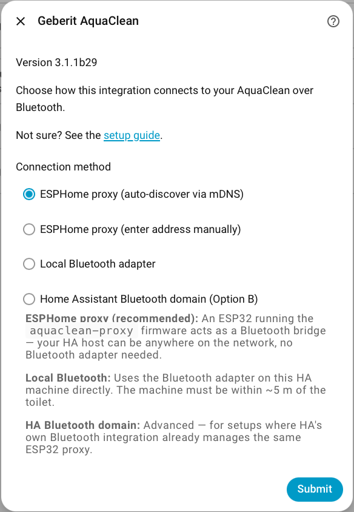
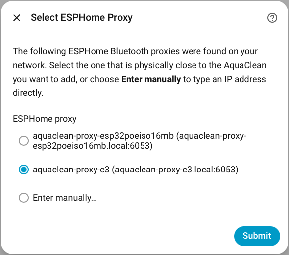
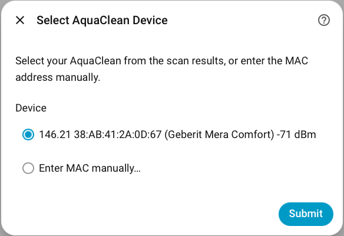
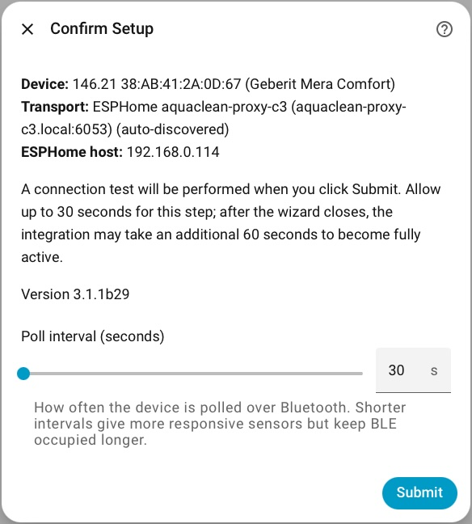
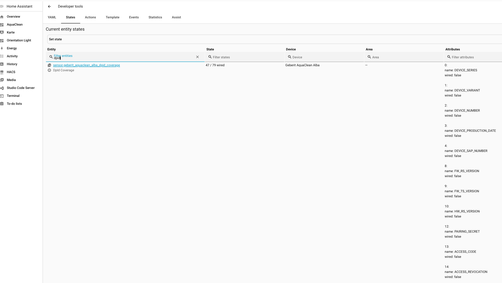
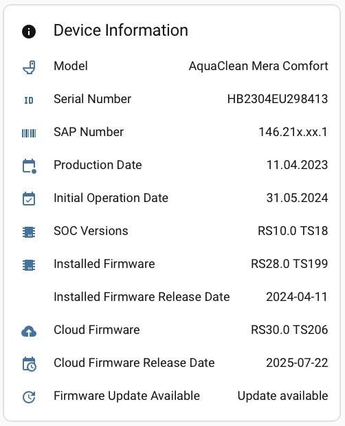

# Geberit AquaClean — HACS Custom Integration

This is the **native Home Assistant integration** for the Geberit AquaClean.
It is installed via HACS and configured entirely within the Home Assistant UI — no separate Linux machine, no MQTT broker, and no config files required.

For the alternative MQTT-based setup (standalone bridge on a Raspberry Pi), see [`homeassistant/SETUP_GUIDE.md`](../homeassistant/SETUP_GUIDE.md).

> ### Two connection paths — ESPHome proxy (recommended) or local BLE adapter
>
> **ESPHome proxy** (an ESP32 running the ESPHome `bluetooth_proxy` component) is the
> recommended and well-tested path. It keeps the HA host out of BLE range entirely.
>
> **Local BLE adapter** (a Bluetooth adapter on the HA host — built-in or USB dongle)
> is supported. The integration uses HA's own `bluetooth` stack for local BLE connections
> (`bluetooth.async_ble_device_from_address()` + `bleak_retry_connector.establish_connection()`),
> so there is no raw adapter conflict with HA's scanner.
>
> **⚠️ Raspberry Pi built-in Bluetooth (BCM4345 chip) is not recommended.**
> On RPi 3/4/5 with HA OS, GATT connections consistently fail due to hardware constraints —
> see [Known hardware limitations — local BLE](#known-hardware-limitations--local-ble-adapter).
> A USB Bluetooth dongle or an ESPHome proxy is the reliable alternative.
>
> Reports from local-BLE users (with or without issues) are welcome via GitHub Issues.

---

## Architecture

```
Geberit AquaClean (BLE)
        ↕  Bluetooth Low Energy
  ┌─────────────────────────────────────────┐
  │  Option A: ESP32 ESPHome proxy          │  (recommended)
  │  ↕  TCP/IP (aioesphomeapi, port 6053)  │
  └─────────────────────────────────────────┘
  ┌─────────────────────────────────────────┐
  │  Option B: local BLE adapter on HA host │  (supported)
  └─────────────────────────────────────────┘
        ↕  Internal coordinator
  HA entities (sensors, switches, binary sensors)
```

### How the integration connects to the toilet

The integration uses the same `BluetoothLeConnector` code as the standalone bridge.

- **With ESPHome proxy:** opens a direct TCP connection to the ESP32 and performs every BLE operation (scan, connect, communicate) over that TCP link.
- **Without ESPHome proxy:** uses HA's `bluetooth` stack to locate the device in HA's scanner cache, then connects via `bleak_retry_connector`. Leave the ESPHome Proxy Host field empty during setup.

### What we use (and don't use) from HA's Bluetooth stack

Home Assistant has its own `bluetooth` integration that manages BLE adapters, exposes a Bluetooth panel, and lets integrations subscribe to BLE advertisements natively.

| Feature | This integration | HA native Bluetooth |
|---------|-----------------|---------------------|
| BLE adapter on HA hardware | Optional | Required |
| Device in HA Bluetooth panel | No | Yes |
| BLE auto-discovery | No | Yes |
| ESPHome proxy supported | Yes | Yes (different path) |
| Hardware cost | ESP32 (~€5–15) optional | ESP32 or BT dongle |
| HA scanner cache (local BLE) | **Yes** (`async_ble_device_from_address`) | n/a |

**For local BLE (no ESPHome proxy):** the integration looks up the `BLEDevice` from HA's
scanner cache and connects via `bleak_retry_connector.establish_connection()`. The BLE adapter
is managed by HA; no raw BlueZ/DBus conflict. The toilet does not appear in HA's Bluetooth
panel and there is no BLE-based auto-discovery.

**For ESPHome proxy:** the integration bypasses HA's BLE stack entirely and opens a direct TCP
connection to the ESP32. The HA host needs no BLE adapter.

The ESP32 ESPHome proxy (€5–15) is the recommended path. Local BLE is supported as an alternative.

---

## Prerequisites

- **Home Assistant OS** or Supervised, version **2024.4.1** or newer
- **HACS** installed (see below)
- **GitHub account** (required for HACS authentication)
- **One of the following BLE transports** (choose one):
  - **ESP32** running ESPHome with `bluetooth_proxy` *(recommended)* — see [`docs/esphome.md`](esphome.md)
  - **Local Bluetooth adapter** on the HA host (built-in or USB dongle), recognised by HA as a BLE adapter
- The BLE transport must be physically close to the toilet (BLE range ~10 m, less through walls)

---

## Step 1 — Install HACS

Skip this step if HACS is already installed.

1. Go to **Settings → Add-ons → Add-on Store**
2. Click the **three dots (⋮)** → **Repositories**
3. Add `https://github.com/hacs/addons` and close
4. Search for **Get HACS**, install it, and click **Start**
5. Open the **Logs** tab of the add-on; follow the instructions and restart Home Assistant
6. Go to **Settings → Devices & Services → Add Integration**, search for **HACS**, and complete GitHub authentication

> After HACS is installed, enable **Advanced Mode** in your profile (Profile → scroll down → Advanced Mode) to see all options.

---

## Step 2 — Add the custom repository to HACS

1. Open **HACS** from the sidebar
2. Click the **three dots (⋮)** in the top right → **Custom repositories**
3. Paste: `https://github.com/jens62/geberit-aquaclean`
4. Select category: **Integration**
5. Click **Add**

---

## Step 3 — Download the integration

1. In HACS, search for **Geberit AquaClean**
2. Click on the repository card
3. Click **Download** (bottom right)
4. In the version popup, select the latest stable version
   To see pre-release versions: toggle **Show beta versions** in the same popup
5. Click **Download** to confirm

---

## Step 4 — Restart Home Assistant

After downloading, Home Assistant must be restarted before the integration appears in the integration list.

**Settings → System → Restart**

---

## Step 5 — Configure the integration

The integration uses a multi-step wizard:

### Step 5a — Connection method

Go to **Settings → Devices & Services → + Add Integration**, search for **Geberit AquaClean** and select it. Choose how to reach the toilet over Bluetooth:

| Option | When to use |
|--------|-------------|
| **ESPHome proxy (auto-discover via mDNS)** *(recommended)* | Your ESP32 runs the `aquaclean-proxy` firmware and is on the same network as HA. The wizard finds it automatically. |
| **ESPHome proxy (enter address manually)** | Same as above, but you type the IP/hostname yourself. |
| **Local Bluetooth adapter** | The HA host has a Bluetooth adapter and is within ~5 m of the toilet. |
| **Home Assistant Bluetooth domain** | Advanced — for setups where HA's own Bluetooth integration already manages the same ESP32 proxy. |



### Step 5b — ESPHome proxy *(ESPHome path only)*

- **Auto-discover:** pick your proxy from the dropdown (shows name and address), or choose *Enter manually*.
- **Manual:** enter the IP or hostname, port (default `6053`), and optional noise encryption key (base64 PSK from your ESPHome YAML — leave blank if not configured).



### Step 5c — Select AquaClean device

The wizard scans for Geberit devices and lists them as:

```
<article prefix>  <MAC>  (<model>)  <RSSI> dBm
```

Example: `146.21  38:AB:41:2A:0D:67  (Geberit Mera Comfort)  −70 dBm`

Select your device. If the scan finds nothing, choose *Enter MAC manually* and type the address (format `XX:XX:XX:XX:XX:XX`).



### Step 5d — Confirm Setup

Review the device and transport summary, set the **poll interval** (default `30 s`), then click **Submit**. A live BLE connection test runs automatically — allow up to 30 seconds. After the wizard closes, the integration may take an additional 60 seconds to become fully active.



---

## Entities

After setup, HA registers three devices under Settings → Devices & Services:

### Geberit AquaClean (toilet)

| Type | Entity |
|------|--------|
| Binary sensor | **BLE Connected** — `True` (green) when the last poll reached the Geberit via BLE, `False` (red) when the last poll failed; attribute `connected_at` shows the timestamp of the last successful BLE connect |
| Binary sensor | User Sitting, Anal Shower Running, Lady Shower Running, Dryer Running |
| Sensor | **BLE Connection** — shows `{BLE device name} (MAC)` after the first successful poll, or just the MAC until then |
| Sensor | Model, Serial Number, SAP Number, Production Date, Initial Operation Date, SOC Versions, **Firmware Version** (e.g. `RS28.0 TS199`), **Firmware Release Date**, **Cloud Firmware Version**, **Cloud Firmware Release Date** |
| Binary sensor | **Firmware Update Available** — `True` when the Geberit cloud has a newer firmware than the device; checked once per hour (failed checks are also cached — no retry until the next hour) |
| Sensor (descale) | Days Until Next Descale, Days Until Shower Restricted, Shower Cycles Until Confirmation, Number of Descale Cycles, Last Descale, Unposted Shower Cycles |
| Sensor (filter) | **Days Until Filter Change**, **Last Filter Reset** (timestamp), **Filter Reset Count** |
| Button | Toggle Lid, Toggle Anal Shower, Toggle Lady Shower |
| Sensor (poll) | Last Poll, Poll Interval, Next Poll |
| Sensor | **BLE Signal** — Geberit BLE advertisement RSSI in dBm (signal strength between ESP32 and toilet) |

### AquaClean Proxy *(only when ESPHome host is configured)*

| Type | Entity |
|------|--------|
| Binary sensor | **Connected** — shows Connected (green) as long as the ESP32 is reachable; only drops to Disconnected when a poll actually fails at the TCP level |
| Sensor | **Connection** — shows `{ESPHome device name} (host:port)` after the first successful poll, or just `host:port` until then |
| Sensor | **WiFi Signal** — ESP32 WiFi RSSI in dBm (requires `platform: wifi_signal` in ESPHome YAML) |
| Sensor (diagnostic) | **Free Heap** — ESP32 free heap memory in bytes (requires `platform: debug, free:` in ESPHome YAML) |
| Sensor (diagnostic) | **Max Free Block** — ESP32 max contiguous free block in bytes (requires `platform: debug, block:` in ESPHome YAML) |
| Sensor (diagnostic) | **Last Connect** — connect time of the last poll cycle in ms |
| Sensor (diagnostic) | **Last Poll** — GATT data fetch time of the last poll cycle in ms |
| Sensor (diagnostic) | **Avg Connect** — rolling average connect time since HA started in ms |
| Sensor (diagnostic) | **Min Connect** — session minimum connect time in ms |
| Sensor (diagnostic) | **Max Connect** — session maximum connect time in ms |
| Sensor (diagnostic) | **Avg Poll** — rolling average GATT fetch time since HA started in ms |
| Sensor (diagnostic) | **Min Poll** — session minimum GATT fetch time in ms |
| Sensor (diagnostic) | **Max Poll** — session maximum GATT fetch time in ms |
| Sensor (diagnostic) | **Poll Samples** — number of successful polls since HA started |
| Sensor (diagnostic) | **Transport** — connection path: `bleak` (local BLE), `esp32-wifi`, or `esp32-eth` |
| Sensor (diagnostic) | **Avg BLE RSSI** — session average BLE signal strength between ESP32 and toilet (dBm) |
| Sensor (diagnostic) | **Min BLE RSSI** — session worst BLE signal strength (dBm) |
| Sensor (diagnostic) | **Max BLE RSSI** — session best BLE signal strength (dBm) |
| Sensor (diagnostic) | **Avg WiFi RSSI** — session average ESP32 WiFi signal (dBm; `Unavailable` in ETH mode) |
| Sensor (diagnostic) | **Min WiFi RSSI** — session worst ESP32 WiFi signal (dBm; `Unavailable` in ETH mode) |
| Sensor (diagnostic) | **Max WiFi RSSI** — session best ESP32 WiFi signal (dBm; `Unavailable` in ETH mode) |
| Button | Restart AquaClean Proxy |

### Alba — checking which DpIds are wired

The Alba uses a DpId-based protocol with 79 known data points. Not all of them are exposed as
Home Assistant entities yet. A dedicated diagnostic sensor shows the current wiring coverage
and lists every unwired DpId by name.

**To check coverage:**

1. Go to **Settings → Developer Tools → States**
2. In the **Filter entities** box, type `dpid`
3. Select `sensor.geberit_aquaclean_alba_dpid_coverage`

The **State** column shows how many DpIds are currently wired (e.g. `47 / 79 wired`).

The **Attributes** panel on the right lists every known DpId with its name and wiring status:

```
0:
  name: DEVICE_SERIES
  wired: false
1:
  name: DEVICE_VARIANT
  wired: false
...
564:
  name: ANAL_SHOWER_STATUS
  wired: true
```

DpIds with `wired: false` are known to the protocol but not yet exposed as HA entities.



If a specific DpId you need is not yet wired, open a
[GitHub issue](https://github.com/jens62/geberit-aquaclean/issues) with the DpId number
and what you'd like to do with it.

---

## Firmware update check

### How the Geberit Home app checks for firmware

When you launch the Geberit Home app, it connects to the Geberit cloud to check
whether new firmware is available for your toilet. This happens automatically on
every launch — no Geberit account or login is required.

You can observe this behaviour directly: disable Wi-Fi and mobile data while the
app is running, then restart it. The app will prompt you to connect to the internet.
This prompt is not required for everyday use — the toilet works entirely over
Bluetooth — but the app cannot perform the firmware check without internet access.

If a newer firmware version is available, the app downloads it from the cloud and
transfers it to the toilet over Bluetooth. This is the only reason the app requires
internet access.

### How the HACS integration checks for firmware

The HACS integration performs the same cloud-based firmware check. After the first
successful Bluetooth connection to your toilet, the integration queries the Geberit
firmware service to determine:

- The currently installed firmware version (read from the device over Bluetooth)
- The latest available firmware version in the Geberit cloud
- Whether an update is available

This information is exposed as Home Assistant sensors. All five sensors are available
for every supported model (AquaClean Mera Comfort, Mera Classic, Sela, and Alba):

| Entity | Description |
|--------|-------------|
| **Installed Firmware** | Firmware version currently on the device (e.g. `RS28.0 TS199`) |
| **Installed Firmware Release Date** | Release date of the installed version |
| **Cloud Firmware** | Latest version available in the Geberit cloud (e.g. `RS30.0 TS206`) |
| **Cloud Firmware Release Date** | Release date of the latest cloud version |
| **Firmware Update Available** | Binary sensor — `on` when a newer version exists |



The check runs after the first successful Bluetooth connect and then once per hour. A failed check (no internet, unrecognised firmware version) is also cached — it will not retry until the next hourly slot. Restarting HA resets the cache and forces an immediate re-check on the next poll.
The result is cached between checks, so it does not generate network traffic on
every poll.

> **Note:** The HACS integration only *reports* firmware update availability. It
> does not download or install firmware. To update the firmware on your toilet,
> use the official Geberit Home app.
>
> A button to manually trigger an immediate firmware check is planned —
> see the [roadmap](roadmap.md#hacs-open-items).

### Logging

The firmware check result is logged at `INFO` level. Home Assistant's default log
level for custom components is `WARNING`, so a successful check produces no visible
log output. To see firmware check results in `home-assistant.log`, add the following
to your `configuration.yaml`:

```yaml
logger:
  default: warning
  logs:
    custom_components.geberit_aquaclean: info
```

A failed check (e.g. no internet access) is always logged at `WARNING` level and
visible in the default log output. Look for one of these lines:

```
WARNING ... Firmware update check: Device firmware X.Y not found in Geberit cloud
WARNING ... Firmware cloud check failed: <reason>
WARNING ... Firmware update check error: <reason>
```

---

## Dashboard

A ready-to-use Lovelace dashboard is included in the repository at [`lovelace/dashboard.yaml`](../lovelace/dashboard.yaml).
It covers live status, controls, poll countdown, descale statistics, and device information — using only built-in HA card types (no extra HACS plugins needed).

### Import

1. **Settings → Dashboards → Add Dashboard** → name it e.g. "AquaClean", click **Create**
2. Open the new dashboard → click the **pencil (edit)** icon → **three dots (⋮)** → **Raw configuration editor**
3. Paste the contents of [`lovelace/dashboard.yaml`](../lovelace/dashboard.yaml) and click **Save**

> **⚠️ HA strips all YAML comments on save.**
> When you save in the Raw configuration editor, Home Assistant permanently removes every
> comment line from your dashboard YAML. Any commented-out optional blocks (like the gauge
> below) will be gone the next time you open the editor.
> **Add optional cards before saving**, or keep the original `lovelace/dashboard.yaml`
> file as your reference copy.

### Poll countdown bar *(requires `custom:timer-bar-card`)*

The Poll Status card includes a `custom:timer-bar-card` that drains smoothly from the
last poll to the next poll. It requires the **Timer Bar Card** frontend plugin from HACS:

1. Open **HACS → Frontend**
2. Search for **Timer Bar Card** → Install → reload browser

The bar card reads `sensor.geberit_aquaclean_last_poll` and
`sensor.geberit_aquaclean_next_poll` directly as start/end timestamps.
No additional template sensors are needed.

### Signal quality labels *(requires `configuration.yaml` additions)*

The **BLE Connection** and **ESPHome Proxy** dashboard cards display labels such as
*"Excellent (−62 dBm)"* or *"Fair (−74 dBm)"* for signal strength. These are
computed by two template sensors that must be added to your Home Assistant
`configuration.yaml`.

See [`homeassistant/configuration_hacs.yaml`](../homeassistant/configuration_hacs.yaml)
for the complete template sensor definitions.

**To add them:**

1. Open your `configuration.yaml`
2. Paste the `template:` block from
   [`homeassistant/configuration_hacs.yaml`](../homeassistant/configuration_hacs.yaml)
3. Reload via **Developer Tools → YAML → Template Entities → Reload**

---

**Nobody on the toilet — User Sitting = Frei:**


**Toilet in use — User Sitting = Erkannt:**


---

## Automations

### Error notification when the toilet is unreachable

When a poll fails, `binary_sensor.geberit_aquaclean_ble_connected` turns `off` and its `error_hint` attribute contains a human-readable explanation (e.g. *"Ensure the Geberit AquaClean is powered on and within BLE range…"*).

Use this to send a push notification with the specific hint:

**Settings → Automations & Scenes → Create Automation → Edit in YAML:**

```yaml
alias: AquaClean — notify on connection error
trigger:
  - platform: state
    entity_id: binary_sensor.geberit_aquaclean_ble_connected
    to: "off"
action:
  - service: notify.mobile_app_your_phone   # replace with your notifier
    data:
      title: "AquaClean unreachable"
      message: >
        {{ state_attr('binary_sensor.geberit_aquaclean_ble_connected', 'error_hint')
           | default('Connection failed — check HA logs for details.') }}
```

> Replace `notify.mobile_app_your_phone` with your actual notifier (e.g. `notify.mobile_app_jens_iphone`).
> Add a `for: "00:02:00"` condition to the trigger to avoid alerts on transient single-poll failures.

The `error_hint` is also visible directly on the **BLE Connection** and **ESPHome Proxy** dashboard cards — it appears as the **Error Hint** row when a poll has failed and is blank when everything is working.

---

## Updating

HACS shows a notification when a new version is available (Settings → Devices & Services → HACS shows a badge).

To update:
1. Open HACS → find Geberit AquaClean → **Update** (or three dots → **Redownload**)
2. Restart Home Assistant

### Upgrading to v3.1.2 — model-specific entity sets (delete-and-recreate required)

v3.1.2 introduces model-specific entity registration: only the entities your device actually supports are created. Entities for unsupported features (e.g. orientation light on a Mera Classic) are no longer registered by default.

Because Home Assistant cannot automatically remove entities that already exist in the registry, you need to **delete and recreate the integration once** to get a clean entity set:

1. Settings → Devices & Services → Geberit AquaClean → ⋮ → **Delete**
2. Add integration again (HACS → Geberit AquaClean or Settings → Add Integration)
3. Complete the setup wizard — your device model is detected automatically

After recreating, only the entities relevant to your device are registered. The correct model is detected from the BLE advertisement (wizard) or from the first poll via proc 0x82 (manual MAC entry — applied from the second HA restart onwards).

> **HACS only sees GitHub Releases, not bare git tags.** If a new version does not appear after clicking the three dots → **Update information**, the release was likely only tagged but not published as a GitHub Release.

---

## Logging and troubleshooting

### Enable debug logging

Add to your `configuration.yaml` and restart:

```yaml
logger:
  default: warning
  logs:
    custom_components.geberit_aquaclean: debug   # integration glue code
    aquaclean_console_app: debug                 # BLE protocol library
```

> This setting has no effect on the standalone bridge; it only controls the HACS integration logging.

> **`trace` / `silly` cannot be set in `configuration.yaml`.**
> HA validates log level names at config load time, before custom integrations are imported.
> Because `trace` and `silly` are registered by our integration (not by Python's standard
> `logging` module), HA does not know them yet and rejects the config with an error.
> Use the dynamic method or the startup automation below instead.

### Find the logs

**Settings → System → Logs → Show raw logs** — filter for `aquaclean` or `geberit`.

Or use the dynamic approach (no restart required):
**Settings → Developer Tools → Actions** → call action `logger.set_level` with:

```yaml
custom_components.geberit_aquaclean: debug
aquaclean_console_app: debug
```

### Record logs to a file

Useful when reporting a bug — attach the saved log file to the GitHub issue.

#### HA core log

> **Precondition:** The **Terminal & SSH** add-on must be installed and running on your Home Assistant instance.
> Install it via **Settings → Add-ons → Add-on Store**, search for `Terminal & SSH` (by Home Assistant), set a password in the Configuration tab, set the SSH port to `22`, enable **Start on boot**, and start it. The username is `root`.

**Windows PowerShell:**

```powershell
$date = Get-Date -Format "yyyy-MM-dd_HH-mm"
ssh root@192.168.0.198 "ha core logs --follow" | Tee-Object -FilePath "C:\Users\jens\Downloads\ha_core_$date.log"
```

Replace `root@192.168.0.198` with your HA user and IP.

**Mac / Linux:**

```bash
sshpass -p 'PASSWORD' ssh USER@IP_ADDRESS "ha core logs --follow" | tee "$HOME/Downloads/ha_core_$(date +%F_%H-%M).log"
```

#### ESPHome proxy log

The proxy exposes a live event stream at `http://<proxy-IP>/events`.

**Mac:**

```bash
curl -sN http://IP_ADDRESS/events \
  | grep --line-buffered "data:" \
  | perl -MPOSIX -pe '$|=1; print strftime("[%H:%M:%S] ", localtime)' \
  | tee "$HOME/Downloads/esp_proxy_$(date +%F_%H-%M).log"
```

**Linux:**

```bash
curl -sN http://IP_ADDRESS/events \
  | grep --line-buffered "data:" \
  | awk '{print strftime("[%H:%M:%S]"), $0; fflush()}' \
  | tee "$HOME/Downloads/esp_proxy_$(date +%F_%H-%M).log"
```

**Windows PowerShell:**

```powershell
$date = Get-Date -Format "yyyy-MM-dd_HH-mm"
curl.exe -sN "http://IP_ADDRESS/events" | ForEach-Object {
    if ($_ -match "data:") { "$(Get-Date -Format '[HH:mm:ss] ')$_" }
} | Tee-Object -FilePath "$env:USERPROFILE\Downloads\esp_proxy_$date.log"
```

Replace `IP_ADDRESS` with your ESP32 proxy IP (e.g. `192.168.0.114`). Use `Ctrl+C` to stop.

---

### Enable trace / silly logging

`trace` and `silly` work via `logger.set_level` once the integration is loaded, but not in
`configuration.yaml` (see note above). To apply them automatically at every HA start, add
this automation:

**Settings → Automations & Scenes → Create Automation → Edit in YAML:**

```yaml
alias: AquaClean — enable trace logging at startup
trigger:
  - platform: homeassistant
    event: started
action:
  - action: logger.set_level
    data:
      custom_components.geberit_aquaclean: trace
      aquaclean_console_app: trace   # or: silly
```

The automation fires after all integrations have loaded, so `trace`/`silly` are already
registered when the action runs.

> **Tracing the startup poll (first refresh on HA restart)?**
> The automation fires *after* `async_setup_entry` and the first coordinator refresh have
> already run — too late to capture startup behaviour.
>
> Instead, set the level dynamically first, then reload only the integration entry:
>
> 1. **Settings → Developer Tools → Actions → `logger.set_level`:**
>    ```yaml
>    custom_components.geberit_aquaclean: trace
>    aquaclean_console_app: trace
>    ```
> 2. **Settings → Devices & Services → Geberit AquaClean → three dots (⋮) → Reload**
>
> This re-runs `async_setup_entry` and the first poll with trace active — no full HA restart needed.

### Common issues

| Symptom | Cause | Fix |
|---------|-------|-----|
| "Cannot connect" on config form | Wrong MAC, ESP32 unreachable, or toilet off | Check MAC, verify ESP32 at `http://192.168.0.160`, ensure toilet is on |
| "Unsupported device" abort with GATT UUIDs | Device connected but uses an unknown GATT profile (AquaClean Alba is now supported — this applies to other unrecognised variants) | Follow the link in the message to open a GitHub issue with the displayed UUIDs and your device model |
| Physical remote shows yellow exclamation / red on re-pair | Bridge polling conflicts with remote pairing — known limitation on AquaClean Alba ([#21](https://github.com/jens62/geberit-aquaclean/issues/21)) | Increase poll interval; remote can be re-paired after disabling the integration temporarily |
| New version not shown in HACS | Version was pushed as git tag only, not a GitHub Release | Click three dots → **Update information**; if still missing, a Release is missing on GitHub |
| All entities unavailable after setup | Coordinator poll failed | Check logs for the actual error; most likely ESP32 or BLE issue |
| `AttributeError: 'HassLogger' has no attribute 'trace'` | Outdated version (< 2.4.18) | Update to latest via HACS |
| Duplicate subscription error (`Only one API subscription`) | Previous TCP connection not released | Restart HA; covered by v2.4.15+ fix |
| Config flow: "0 BLE advertisement packets" / BLE scan always times out | The **ESPHome integration** in HA is managing the same ESP32 and permanently holds the API subscription slot | In HA → Settings → Integrations, **disable** (not delete) the ESPHome integration that manages your proxy ESP32. See [ESPHome integration conflict](#esphome-integration-conflict) below. |
| E0003 every poll, times out at 36 s, then "not in cache" | Raspberry Pi built-in BT (BCM4345) + bleak 2.1.1 hardware limitation | Use a USB BT dongle or ESPHome proxy — see [Known hardware limitations](#known-hardware-limitations--local-ble-adapter) |
| E0002 after Toggle Lid or button press (ESPHome proxy) | On-demand TCP: cold BLE scanner misses device briefly pausing advertising after a command | Fixed in v2.4.62 — update via HACS |

### Known hardware limitations — local BLE adapter

#### Raspberry Pi built-in Bluetooth (BCM4345 chip) — not reliable

Tested on RPi with the built-in BCM4345C0 chip, HA OS, and bleak 2.1.1 (the version HA ships as of early 2026):

**Observed behaviour (log `local-assets/config-hacs-no-esp.log`, 2026-03-03):**

1. **Phase 1 (~5 polls, ~3 min):** Device IS found in HA's scanner cache. `establish_connection` is called but times out at exactly 36 s every attempt. `Finished fetching geberit_aquaclean data in 36.0 seconds (success: False)`.
2. **Phase 2 (onwards):** Device drops from HA's cache. "Device not in cache yet; waiting up to 30 s for advertisement" — permanent timeout. The first phase's connect attempts suppressed HA's scanner, so no fresh advertisements arrived to renew the cache entry.

**Root causes:**

| # | Problem | Effect |
|---|---------|--------|
| 1 | **BCM4345 cannot scan and connect simultaneously** — the chip pauses the active BLE scanner while a GATT connection is being established | Each 36 s failed connect attempt blocks HA's scanner; no advertisements received; Geberit drops from cache after ~5 failures |
| 2 | **bleak 2.1.1 takes ~25 s per connect attempt** on RPi5 + BCM4345C0 + BlueZ 5.84 (bleak 2.0.0 = ~1.8 s on the same hardware) | `bleak_retry_connector.establish_connection()` has `MAX_CONNECT_TIME = 35 s` — barely enough for one attempt; never completes |

These are not code bugs. They are hardware and driver constraints that cannot be worked around without changing the hardware or BLE library.

**ESPHome proxy is unaffected** — the ESP32's dedicated BLE radio has no scanner/connector conflict and bleak 2.1.1 is not involved.

**Workarounds for local BLE:**

- **USB Bluetooth dongle** — a dedicated adapter avoids the scan/connect scheduler conflict. Tested adapters: *unknown, community reports welcome*.
- **ESPHome proxy** — the recommended path; an ESP32 (~€5–15) eliminates the problem entirely.

### ESPHome integration conflict

The ESP32 firmware allows **only one API client to hold the BLE advertisement subscription at a time**. If you have already registered your ESP32 as an ESPHome device in HA (via the ESPHome integration), that integration holds the subscription slot permanently — the geberit_aquaclean integration cannot connect and the BLE scanner returns 0 packets.

**Symptom:** Config flow wizard shows "device not found" or "0 BLE advertisement packets during 10 s scan" despite the ESP32 being reachable.

**Fix:** In HA → Settings → Integrations, find the ESPHome integration entry for your proxy ESP32 and **disable** it (three dots → Disable). Do not delete it — disabling is reversible.

After disabling, retry the config flow. The geberit_aquaclean integration will then manage the ESP32 directly.

> **Note:** This only applies to users who previously added the same ESP32 to HA via the built-in ESPHome integration. If you flashed your ESP32 specifically for use as an AquaClean proxy and never added it to the ESPHome integration, this does not apply.

### Multiple devices on the same ESPHome proxy

If you have more than one Geberit toilet and all config entries point at the same ESP32 proxy, only the first device will connect — the others silently fail to appear.

**Root cause:** The ESP32 firmware only allows **one BLE advertisement subscription at a time** across all API clients. When the first coordinator opens a scan, the proxy rejects any concurrent scan from a second coordinator before that second device ever appears in the HA log. The failure happens at the subscription layer, not at the BLE GATT layer — so no second MAC address is ever logged.

**Fix (v3.1.3b1+):** A per-proxy serialization lock was added to `coordinator.py`. All coordinators sharing the same ESPHome host now queue their polls and take turns — the subscription conflict no longer occurs. Upgrade to v3.1.3b1 or later.

**Workaround for older versions:** Use one dedicated ESP32 proxy per toilet. Each config entry stores its own ESPHome host; pointing them at separate proxies avoids the subscription conflict entirely. The config flow wizard supports selecting a different proxy per device.

### ESPHome proxy troubleshooting

See [`docs/esphome-troubleshooting.md`](esphome-troubleshooting.md) for ESP32-specific issues (stuck BLE scanner, subscription conflicts, auto-restart).

---

## Disabling the integration

The integration can be disabled or deleted from **Settings → Devices & Services → Geberit AquaClean → three dots (⋮)**.

Deleting it removes the config entry but leaves historical data in the HA recorder. To fully remove all traces (devices, entities), restart HA after deletion.

---

## Coexistence with the standalone bridge

Do **not** run both the HACS integration and the standalone MQTT bridge against the same ESP32 at the same time. Both open TCP connections to the ESP32 and compete for the single BLE advertisement subscription slot. See [`docs/ble-coexistence.md`](ble-coexistence.md).

Also disable the **ESPHome** integration in HA (`Settings → Devices & Services → ESPHome`) if it is tracking the same ESP32 proxy — it would occupy the subscription slot and block all BLE connections from the bridge.
