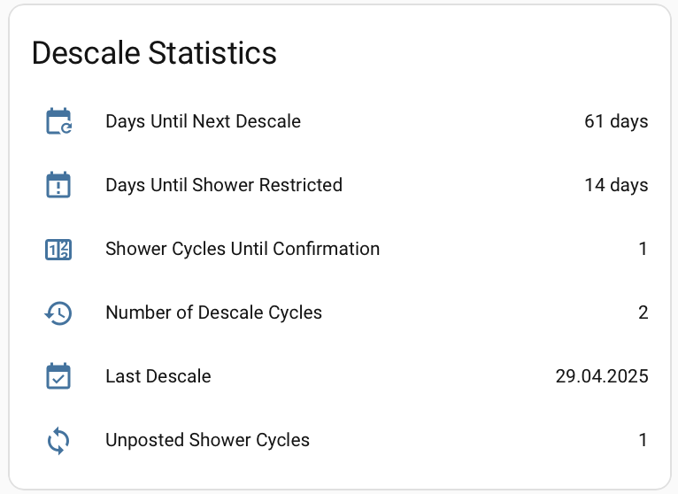

# Home Assistant Integration

Two integration methods are available:

| Method | Requires | Status |
|--------|----------|--------|
| **HACS native integration** | HACS installed in HA | Beta — see below |
| **MQTT Discovery** (standalone bridge) | MQTT broker + Raspberry Pi / server near the toilet | Stable |

---

## HACS native integration (beta)

No MQTT broker required. The integration talks directly to the AquaClean over BLE
(local adapter or ESPHome proxy) from within Home Assistant.

### Install

1. **Add the custom repository** — HACS → ⋮ → **Custom repositories**
   → URL: `https://github.com/jens62/geberit-aquaclean` → category **Integration** → Add

2. **Enable beta versions** — HACS → Settings → enable **Show beta versions**
   (or "Experimental features", depending on your HACS version)

3. **Install** — HACS → Integrations → search **Geberit AquaClean**
   → Download → select `v2.4.12-hacs-beta`

4. **Restart Home Assistant**

5. **Configure** — Settings → Devices & Services → **Add Integration**
   → search **Geberit AquaClean** → fill in:
   - BLE MAC address of your AquaClean (e.g. `38:AB:41:2A:0D:67`)
   - ESPHome Proxy Host (optional — recommended if the toilet is not in BLE range of HA)
   - Poll interval (default 30 s)

> **ESPHome proxy note:** if you use the ESP32 proxy, ensure the `aquaclean-proxy`
> integration in Home Assistant is **disabled** — two simultaneous connections to the
> ESP32 block BLE scanning.  See [esphome-troubleshooting.md](esphome-troubleshooting.md).

### Local BLE vs ESPHome proxy

The **ESPHome Proxy Host** field is the only switch:

| `ESPHome Proxy Host` field | Transport used |
|----------------------------|----------------|
| Empty (left blank)         | Local BLE adapter on the HA machine (bleak) |
| Filled in (e.g. `192.168.0.160`) | ESPHome proxy via aioesphomeapi over TCP |

No separate toggle exists — the presence of the host determines which path is used.
The ESPHome port defaults to `6053`; the encryption key is optional (leave blank for
unencrypted, which is the recommended default on a trusted home LAN).

### Changing settings after setup (options flow)

All settings can be changed without re-adding the integration:

**Settings → Devices & Services → Geberit AquaClean → Configure**

The Configure button opens the options form with all current values pre-filled:
- BLE MAC address
- ESPHome Proxy Host / Port / Encryption Key
- Poll interval

A connection test is performed on save.  The integration reloads automatically — no
HA restart needed.

### Logs

**Settings → System → Logs** — search or filter for `geberit_aquaclean`.

Raw log file: `/config/home-assistant.log`

### Log level

Not configurable from the UI.  Set it in `configuration.yaml`:

```yaml
logger:
  default: warning
  logs:
    custom_components.geberit_aquaclean: debug   # integration glue code
    aquaclean_console_app: debug                  # BLE protocol library
```

Useful levels:
- `warning` — errors and warnings only (default / production)
- `info` — connection lifecycle events
- `debug` — full BLE handshake, GATT operations, coordinator polls

Restart HA after changing `configuration.yaml`.

### Dashboard card (button-card)

A ready-made dashboard using [Custom Button Card](https://github.com/custom-cards/button-card)
is provided at `homeassistant/dashboard_button_card_hacs.yaml`.

**Install the SVG icons first** — the card uses custom Geberit graphics that must be
copied manually to `/config/www/custom_icons/geberit/` on your HA instance
(File Editor or Samba add-on):

| File in `graphics/` | Required by |
|---------------------|-------------|
| `adjustabletoiletseat.svg` | Toggle Lid button |
| `is_user_sitting-on.svg`, `is_user_sitting-off.svg` | User Sitting sensor |
| `analshower.svg` | Anal Shower button + sensor |
| `ladywash.svg` | Lady Shower button + sensor |
| `dryer_to_the_right-on.svg`, `dryer_to_the_right-off.svg` | Dryer sensor |

**Add the card to your dashboard:**

1. Dashboard → Edit → Add Card → **Manual**
2. Paste the contents of `homeassistant/dashboard_button_card_hacs.yaml`

**Entity IDs** are generated from the fixed device name `"Geberit AquaClean"`, giving
predictable IDs like `binary_sensor.geberit_aquaclean_user_sitting`.  If HA assigns
different IDs on your instance, check **Developer Tools → States** and update the YAML.

**Differences from the MQTT dashboard** (`dashboard_button_card.yaml`):

| MQTT version | HACS version |
|---|---|
| Toggle Lid / Shower are `switch` entities | They are `button` entities — tapping triggers the action |
| Connection Status section | Not present — no connected/error sensors |
| ESPHome Proxy Status section | Not present — proxy handled internally |

### Web UI

The standalone bridge's web UI (REST API on port 8080) does **not exist** in the HACS
integration — it is only started when running `aquaclean-bridge --mode api`.
The HACS integration never starts that process.

HA's own UI replaces everything the web UI provided:

| Standalone web UI | HA equivalent |
|---|---|
| Live device state | Dashboard (`dashboard_button_card_hacs.yaml`) |
| Toggle lid / showers | Button entities on the dashboard |
| Raw entity values | Developer Tools → States |
| State history | History panel / Logbook |
| Configuration | Settings → Devices & Services → Configure |
| Logs / errors | Settings → System → Logs |

### Entities created

| Platform | Entity |
|----------|--------|
| Binary sensor | User Sitting, Anal Shower Running, Lady Shower Running, Dryer Running |
| Sensor | Serial Number, SAP Number, Model, Production Date, Initial Operation Date |
| Sensor (descale) | Days Until Next Descale, Days Until Shower Restricted, Shower Cycles Until Confirmation, Number of Descale Cycles, Last Descale, Unposted Shower Cycles |
| Button | Toggle Lid, Toggle Anal Shower, Toggle Lady Shower |

---

## MQTT Discovery (standalone bridge)

The application integrates with Home Assistant via **MQTT Discovery** — no manual YAML editing required.

For the full setup guide, custom icons, and dashboard card examples see [`homeassistant/SETUP_GUIDE.md`](../homeassistant/SETUP_GUIDE.md).

---

## Architecture

```
AquaClean (BLE) ←→ Raspberry Pi (Bridge) → MQTT Broker → Home Assistant
   [Bathroom]            [Bathroom]           [Network]      [Anywhere]
```

The Raspberry Pi must be physically close to the toilet (BLE range).  Home Assistant can run anywhere on the network.

---

## Quick setup

### 1. Configure MQTT in config.ini

```ini
[MQTT]
server   = 192.168.0.xxx   # IP of your MQTT broker
port     = 1883
topic    = Geberit/AquaClean
```

### 2. Start the bridge

```bash
aquaclean-bridge --mode api
```

By default (`ha_discovery_on_startup = true` in `config.ini`), all Home Assistant MQTT discovery entities are published automatically on every startup — no manual step needed.  You will see in the log:

```
INFO  Published 19 HA discovery entities on startup
```

**Disable automatic publishing** (optional):

```bash
aquaclean-bridge --mode api --no-ha-discovery
```

Or set `ha_discovery_on_startup = false` in `config.ini` to disable permanently.

**Publish manually** (if auto-publish is disabled, or to force a republish):

```bash
aquaclean-bridge --mode cli --command publish-ha-discovery
```

This is safe to run while the service is already active — it uses a separate MQTT connection and requires no BLE.

### 3. Verify in Home Assistant

Go to **Settings → Devices & Services → MQTT** — you will see a **Geberit AquaClean** device with 19 entities grouped together:

| Type | Entities |
|------|---------|
| Binary sensor | User Sitting, Anal Shower Running, Lady Shower Running, Dryer Running |
| Sensor | SAP Number, Serial Number, Production Date, Description, Initial Operation Date, Connected, Error |
| Sensor (descale) | Days Until Next Descale, Days Until Shower Restricted, Shower Cycles Until Confirmation, Number of Descale Cycles, Last Descale, Unposted Shower Cycles |
| Switch | Toggle Lid, Toggle Anal Shower |



---

## Removing entities

To remove all Geberit AquaClean entities from Home Assistant:

```bash
python main.py --mode cli --command remove-ha-discovery
```

This publishes empty retained payloads to all discovery topics.  Only entities created by `publish-ha-discovery` are affected.

---

## Keeping discovery in sync

The discovery configuration is defined alongside the MQTT publish calls in `main.py`.  When a new `send_data_async()` call is added, a matching entity is added to `get_ha_discovery_configs()` in the same file.

Because `ha_discovery_on_startup = true` by default, entities are automatically re-registered each time the bridge restarts — so after any config change, simply restart the service.

---

## Manual configuration (alternative)

If you prefer YAML over auto-discovery, see `homeassistant/configuration_mqtt.yaml` for a complete entity configuration.  All MQTT topics are documented in [mqtt.md](mqtt.md).
