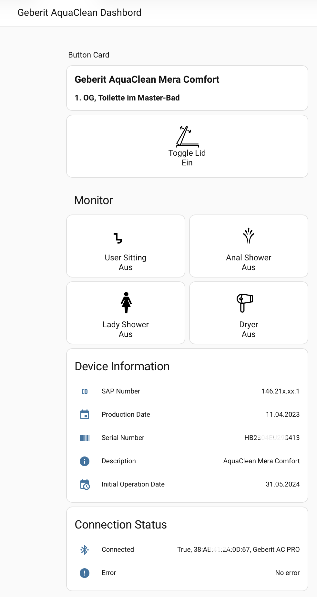
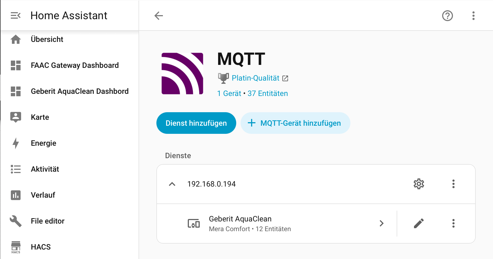

# Geberit AquaClean Home Assistant Integration — MQTT Discovery

This guide covers the **standalone bridge + MQTT Discovery** integration path.

> **Looking for the HACS native integration?** A native HA integration (no MQTT broker required)
> is available and installable directly via HACS.  See
> [docs/home-assistant.md](../docs/home-assistant.md) for setup instructions.

This guide provides complete setup instructions for integrating a Geberit AquaClean smart toilet with Home Assistant via MQTT.




## Table of Contents
- [Architecture](#architecture)
- [Prerequisites](#prerequisites)
- [Installation](#installation)
- [MQTT Topics](#mqtt-topics)
- [Configuration](#configuration)
- [Upgrading](#upgrading)
- [Custom Icons](#custom-icons)
- [Dashboard Cards](#dashboard-cards)
- [Troubleshooting](#troubleshooting)

## Architecture

### Two integration paths

Two integration methods are available — choose the one that matches your setup:

| | MQTT Discovery (this guide) | HACS native integration |
|---|---|---|
| **MQTT broker required** | Yes | No |
| **Raspberry Pi / Linux server required** | Yes (near toilet) | No |
| **ESPHome proxy supported** | Yes | Yes |
| **Works with openHAB / Node-RED** | Yes | No |
| **Recommended for** | Existing MQTT setups; multi-system environments | Simpler setups; HA-only environments |

#### MQTT Discovery architecture

```
AquaClean (BLE) ← → Raspberry Pi (Bridge) → MQTT Broker → Home Assistant
   [Bathroom]           [Bathroom]           [Network]      [Anywhere]
```

The standalone bridge runs on a Raspberry Pi or Linux server near the toilet and publishes device state to MQTT.  Home Assistant (and any other MQTT-capable system) subscribes to those topics.

#### HACS native integration architecture

```
AquaClean (BLE) ← → ESPHome proxy ← → Home Assistant (HACS integration)
   [Bathroom]           [Bathroom]             [Anywhere]
```

The HACS integration runs inside Home Assistant and polls the AquaClean directly — via an ESPHome proxy over TCP (recommended) or a local BLE adapter on the HA machine.  No separate bridge process, no MQTT broker required.  See [docs/home-assistant.md](../docs/home-assistant.md) for setup.

## Prerequisites

- Home Assistant installed (OS, Supervised, Container, or Core)
- MQTT broker configured and running (required for this MQTT Discovery path)
- MQTT integration enabled in Home Assistant
- Custom Button Card installed from HACS (for advanced dashboard)
- Geberit AquaClean device publishing to MQTT (via the standalone bridge)

## Installation

**1. Install the bridge** (Raspberry Pi / Linux server):

```bash
curl -fsSL https://raw.githubusercontent.com/jens62/geberit-aquaclean/main/operation_support/install.sh | bash -s -- latest
```

The script installs system packages, creates `~/venv`, and prints next steps. Re-running it with a new version upgrades in-place.

**2. Edit `config.ini`** — set your BLE device address and MQTT broker:

```ini
[BLE]
device_id = XX:XX:XX:XX:XX:XX   # BLE MAC of your AquaClean (find with: bluetoothctl scan on)

[MQTT]
server = 192.168.0.xxx           # IP of your MQTT broker
```

**3. Install as a background service** (Linux / systemd):

```bash
curl -fsSL https://raw.githubusercontent.com/jens62/geberit-aquaclean/main/operation_support/setup-service.sh | bash
```

The bridge starts automatically on boot and restarts on failure. Logs go to `/var/log/aquaclean/aquaclean.log`.

**4. Home Assistant MQTT Discovery runs automatically** on every startup — no manual command needed (see [Configuration](#configuration) below).

---

## MQTT Topics

The integration uses the following MQTT topics:

### Monitor Topics (State)
- `Geberit/AquaClean/peripheralDevice/monitor/isUserSitting` - Returns `True`/`False`
- `Geberit/AquaClean/peripheralDevice/monitor/isAnalShowerRunning` - Returns `True`/`False`
- `Geberit/AquaClean/peripheralDevice/monitor/isLadyShowerRunning` - Returns `True`/`False`
- `Geberit/AquaClean/peripheralDevice/monitor/isDryerRunning` - Returns `True`/`False`

### Control Topics (Command)
- `Geberit/AquaClean/peripheralDevice/control/toggleLidPosition` - Accepts `true`/`false`

### Information Topics (State)
- `Geberit/AquaClean/peripheralDevice/information/Identification/SapNumber`
- `Geberit/AquaClean/peripheralDevice/information/Identification/ProductionDate`
- `Geberit/AquaClean/peripheralDevice/information/Identification/SerialNumber`
- `Geberit/AquaClean/peripheralDevice/information/Identification/Description`
- `Geberit/AquaClean/peripheralDevice/information/initialOperationDate`
- `Geberit/AquaClean/peripheralDevice/information/firmwareVersion` — main firmware version string (e.g. `RS28.0 TS199`)
- `Geberit/AquaClean/peripheralDevice/information/filterStatus` — JSON object with filter status fields (days remaining, last reset timestamp, reset count etc.)

### Status Topics (State)
- `Geberit/AquaClean/centralDevice/connected`
- `Geberit/AquaClean/centralDevice/error`

## Configuration

You have **two options** for configuring the entities in Home Assistant:

### Option 1: MQTT Discovery (Recommended) ⭐

**Pros:** Automatic entity creation, no manual YAML editing, entities grouped as a device, easier updates
**Cons:** none — discovery is published automatically on every startup

**Steps:**

1. **Start the bridge** — discovery is published automatically on startup (controlled by `ha_discovery_on_startup = true` in `config.ini`):
   ```bash
   sudo systemctl start aquaclean-bridge   # if installed as a service
   # or
   aquaclean-bridge --mode api
   ```

   To publish discovery manually (e.g. after disabling auto-publish):
   ```bash
   aquaclean-bridge --mode cli --command publish-ha-discovery
   ```

   To remove all entities:
   ```bash
   aquaclean-bridge --mode cli --command remove-ha-discovery
   ```

2. **Verify in Home Assistant**:
   - Go to **Settings** → **Devices & Services** → **MQTT**
   - You will see three devices: **Geberit AquaClean** (toilet), **AquaClean Bridge** (bridge process), and **AquaClean Proxy** (ESP32, only if configured)
   - All entities are automatically created — no configuration.yaml editing needed!

   

**Important Notes:**
- The command publishes discovery messages to your MQTT broker (broker address read from `config.ini`)
- Home Assistant (connected to the same MQTT broker) automatically detects and creates the entities
- Works alongside any existing manual MQTT configuration in `configuration.yaml`
- Binary sensors use `payload_on: "True"` and `payload_off: "False"` (capitalized)

### Option 2: Manual Configuration

**Pros:** Full control over entity configuration
**Cons:** Manual YAML editing, entities not grouped as a device, harder to update

**Steps:**

1. **Add MQTT Configuration to configuration.yaml**

   Add the MQTT entities to your `configuration.yaml`. See the complete configuration in [`configuration_mqtt.yaml`](configuration_mqtt.yaml).

   **Important Note:** The binary sensors use `payload_on: "True"` and `payload_off: "False"` (capitalized) to match the MQTT messages from the Geberit device. If your device sends lowercase `true`/`false`, adjust accordingly.

2. **Restart Home Assistant**

   After adding the configuration:
   - Go to **Developer Tools** → **YAML**
   - Click **Check Configuration** to verify syntax
   - Click **Restart** to apply changes

3. **Verify Entities**

   Check that all entities are created:
   - Go to **Settings** → **Devices & Services** → **Entities**
   - Search for "Geberit AquaClean"
   - You should see:
     - 4 binary sensors (monitor states)
     - 13 sensors (identification, descale statistics, connection status)
     - 2 switches (lid control, anal shower)

## Upgrading

> **Using the HACS integration instead?** Upgrade through HACS → Integrations →
> Geberit AquaClean → ⋮ → Redownload.  Then restart Home Assistant.

**Upgrade the bridge** (preserves your `config.ini`):

```bash
bash operation_support/update-to-branch.sh latest
```

Or without the repo cloned:

```bash
curl -fsSL https://raw.githubusercontent.com/jens62/geberit-aquaclean/main/operation_support/update-to-branch.sh | bash -s -- latest
```

Then restart the service:

```bash
sudo systemctl restart aquaclean-bridge
```

Because `ha_discovery_on_startup = true` by default, Home Assistant discovery is re-published automatically on restart — new entities appear in HA without any manual step.

**To populate demand-fetched sensors immediately** (e.g. descale statistics) rather than waiting for the next poll:
```bash
curl http://localhost:8080/data/statistics-descale
```

**To remove all entities and start fresh:**
```bash
aquaclean-bridge --mode cli --command remove-ha-discovery
aquaclean-bridge --mode cli --command publish-ha-discovery
```

---

## Custom Icons

### Icon Setup

1. Create the directory structure in your Home Assistant configuration:
   ```bash
   mkdir -p /config/www/custom_icons/geberit
   ```

2. Copy the SVG icon files from the project's `graphics/` folder to `/config/www/custom_icons/geberit/`:
   ```bash
   cp /path/to/geberit-aquaclean/graphics/is_user_sitting-on.svg /config/www/custom_icons/geberit/
   cp /path/to/geberit-aquaclean/graphics/is_user_sitting-off.svg /config/www/custom_icons/geberit/
   cp /path/to/geberit-aquaclean/graphics/analshower.svg /config/www/custom_icons/geberit/
   cp /path/to/geberit-aquaclean/graphics/ladywash.svg /config/www/custom_icons/geberit/
   cp /path/to/geberit-aquaclean/graphics/dryer_to_the_right-on.svg /config/www/custom_icons/geberit/
   cp /path/to/geberit-aquaclean/graphics/dryer_to_the_right-off.svg /config/www/custom_icons/geberit/
   cp /path/to/geberit-aquaclean/graphics/adjustabletoiletseat.svg /config/www/custom_icons/geberit/
   ```

   **Note:** Replace `/path/to/geberit-aquaclean` with the actual path where you cloned this repository. The required SVG files are available in the [`graphics/`](https://github.com/jens62/geberit-aquaclean/tree/main/graphics) folder of this project.

3. Set proper permissions:
   ```bash
   chmod 755 /config/www/custom_icons/
   chmod 755 /config/www/custom_icons/geberit/
   chmod 644 /config/www/custom_icons/geberit/*
   ```

4. Verify icon accessibility by opening in browser:
   ```
   http://YOUR_HOME_ASSISTANT:8123/local/custom_icons/geberit/is_user_sitting-on.svg
   ```

### Icon Files Included

The following icon files are included in the project's [`graphics/`](https://github.com/jens62/geberit-aquaclean/tree/main/graphics) folder:
- **User Sitting**: Two states (`is_user_sitting-on.svg`, `is_user_sitting-off.svg`)
- **Anal Shower**: Single icon (`analshower.svg`) - brightness adjusted for on/off states
- **Lady Shower**: Single icon (`ladywash.svg`) - brightness adjusted for on/off states
- **Dryer**: Two states (`dryer_to_the_right-on.svg`, `dryer_to_the_right-off.svg`)
- **Toggle Lid**: Single icon (`adjustabletoiletseat.svg`) - brightness adjusted for on/off states

## Dashboard Cards

Two dashboard card options are provided:

### Option 1: Simple Card (No Custom Components)

Uses standard Home Assistant entities card. See [`dashboard_simple_card.yaml`](dashboard_simple_card.yaml).

**Features:**
- No additional components required
- Simple list view
- Shows all states and information

### Option 2: Advanced Card with Custom Icons (Recommended)

Uses Custom Button Card from HACS with custom SVG icons. See [`dashboard_button_card.yaml`](dashboard_button_card.yaml).

**Features:**
- Visual tile layout (2 columns)
- Custom SVG icons
- Different icons for on/off states
- Brightness dimming for inactive states
- More modern appearance

**Prerequisites:**
- Install **Custom Button Card** from HACS:
  1. Go to **HACS** → **Frontend**
  2. Search for "button-card"
  3. Click **Download**
  4. Restart Home Assistant

### Adding the Card to Your Dashboard

1. Edit your dashboard (three dots → **Edit Dashboard**)
2. Click **+ ADD CARD**
3. Scroll down and select **Manual** card
4. Paste the YAML from either file
5. Click **Save**

## Troubleshooting

### Icons Not Displaying

1. **Check file paths:** Verify files exist in `/config/www/custom_icons/geberit/`
2. **Check permissions:** Ensure files are readable (644)
3. **Test URL:** Open icon URL directly in browser
4. **Clear cache:** Hard refresh browser (Ctrl+Shift+R or Cmd+Shift+R)
5. **Check ownership:** Match ownership with other files in `/config/www/`
   ```bash
   ls -la /config/www/community/
   chown -R $(stat -c '%u:%g' /config/www/community) /config/www/custom_icons/
   ```

### Binary Sensors Show "Unknown"

1. **Check MQTT payload:** Verify your device sends `True`/`False` (capitalized)
2. **Monitor MQTT:** Use MQTT Explorer or Home Assistant's MQTT integration
3. **Adjust payload:** If needed, change `payload_on` and `payload_off` in configuration
4. **Restart:** Always restart Home Assistant after configuration changes

### Switch Not Working

1. **Check MQTT topics:** Verify the command topic is correct
2. **Test manually:** Use Developer Tools → Services → `mqtt.publish` to test
3. **Check optimistic mode:** The switch is set to `optimistic: true` - it assumes commands succeed

### Custom Button Card Not Found

1. **Install from HACS:** HACS → Frontend → Search "button-card" → Download
2. **Clear browser cache:** After installation, hard refresh (Ctrl+Shift+R)
3. **Restart Home Assistant:** Sometimes needed after HACS installations

## File Structure

```
/config/
├── configuration.yaml (add MQTT section)
├── www/
│   └── custom_icons/
│       └── geberit/
│           ├── is_user_sitting-on.svg
│           ├── is_user_sitting-off.svg
│           ├── analshower.svg
│           ├── ladywash.svg
│           ├── dryer_to_the_right-on.svg
│           └── dryer_to_the_right-off.svg
└── dashboards/
    └── geberit_aquaclean.yaml (optional)
```

## Customization

### Adjusting Button Card Height

Change the `height` value in the button card YAML:
```yaml
styles:
  card:
    - height: 130px  # Adjust this value (100-200px recommended)
```

### Changing Icon Size

Modify the `entity_picture` size:
```yaml
entity_picture:
  - width: 50px   # Adjust width
  - height: 50px  # Adjust height
```

### Adjusting Brightness for Off State

Change the `filter: brightness()` value:
```yaml
styles:
  entity_picture:
    - filter: brightness(0.5)  # 0.0 (black) to 1.0 (full brightness)
```

## Credits

Configuration originally adapted from OpenHAB setup to Home Assistant.

## License

Free to use and modify for personal use.
